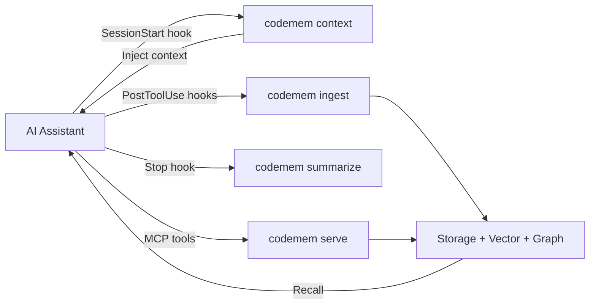

# Codemem

[](https://github.com/cogniplex/codemem/actions/workflows/ci.yml)
[](https://codecov.io/gh/cogniplex/codemem)
[](https://crates.io/crates/codemem-cli)
[](LICENSE)

A standalone Rust memory engine for AI coding assistants. Single binary, zero runtime deps.

Codemem stores what your AI assistant discovers -- files read, symbols searched, edits made -- so repositories don't need re-exploring across sessions. It supports cross-repo structural relationships for monorepo intelligence and wires into any MCP-compatible tool.

## Quick Start

### 1. Install

```bash
cargo install codemem-cli
```

Or download a prebuilt binary from [GitHub Releases](https://github.com/cogniplex/codemem/releases) (macOS, Linux -- x86_64 and ARM64).

### 2. Initialize

```bash
cd your-project
codemem init
```

This downloads the local embedding model (~440MB, one-time), registers 4 lifecycle hooks, and configures the MCP server (33 tools) for your AI assistant.

### 3. Done

Codemem now automatically:
- **Injects context** at the start of each session (recent sessions, key decisions, file hotspots)
- **Captures** what your AI reads, searches, and edits via PostToolUse hooks
- **Generates summaries** when conversations end
- **Provides 33 MCP tools** for active recall, graph traversal, and code search

### Optional: remote embeddings

By default, Codemem runs a local BERT model -- no API key needed. To use a remote provider instead:

```bash
# Ollama (local server)
export CODEMEM_EMBED_PROVIDER=ollama

# OpenAI
export CODEMEM_EMBED_PROVIDER=openai
export CODEMEM_EMBED_API_KEY=sk-...

# Any OpenAI-compatible API (Voyage AI, Together, Azure, etc.)
export CODEMEM_EMBED_PROVIDER=openai
export CODEMEM_EMBED_URL=https://api.voyageai.com/v1
export CODEMEM_EMBED_MODEL=voyage-3
export CODEMEM_EMBED_API_KEY=pa-...
```

### Optional: observation compression

Compress raw tool observations into concise summaries via LLM before storage:

```bash
export CODEMEM_COMPRESS_PROVIDER=ollama   # or openai, anthropic
```

See [Observation Compression](#observation-compression) for full configuration.

## How It Works

Codemem does three things:

1. **Passively captures** what your AI assistant reads, searches, and edits via lifecycle hooks
2. **Actively recalls** relevant context via MCP tools when your assistant needs it
3. **Injects context** at session start so your assistant picks up where it left off



## At a Glance

| Metric | Value |
|--------|-------|
| Codebase | ~23,500 LOC Rust across 12 crates |
| Tests | 352 (all passing) |
| MCP Tools | 33 |
| CLI Commands | 15 |
| Lifecycle Hooks | 4 (SessionStart, UserPromptSubmit, PostToolUse, Stop) |
| Language Extractors | 6 (Rust, TypeScript, Python, Go, C/C++, Java) |
| Embeddings | 768-dim, pluggable via `CODEMEM_EMBED_PROVIDER`: Candle (local, default), Ollama, OpenAI-compatible |
| Graph Algorithms | 25 (PageRank, Louvain, betweenness centrality, BFS/DFS, etc.) |
| Memory Types | 7 |
| Relationship Types | 23 |
| Consolidation Cycles | 4 (Decay, Creative/REM, Cluster, Forget) |
| Scoring | BM25 token scoring + 9-component hybrid |
| Observation Compression | Pluggable: Ollama (local), OpenAI, Anthropic |
| File Watching | Real-time via notify (<50ms debounce) |
| Session Tracking | Cross-session continuity with pattern detection |
| Storage | System-wide at `~/.codemem/` with namespace scoping |

Embeddings are contextual -- metadata and graph context are enriched before embedding for higher recall quality.

### Hybrid Scoring

Recall uses a 9-component hybrid scoring formula with BM25 for token overlap:

| Component | Weight |
|-----------|--------|
| Vector similarity | 25% |
| Graph strength (PageRank + betweenness + degree + cluster) | 25% |
| BM25 token overlap | 15% |
| Temporal | 10% |
| Tags | 10% |
| Importance | 5% |
| Confidence | 5% |
| Recency | 5% |

## Lifecycle Hooks

Codemem registers 4 hooks during `codemem init` for full session lifecycle coverage:

| Hook | Command | What It Does |
|------|---------|-------------|
| **SessionStart** | `codemem context` | Queries recent sessions, key memories, file hotspots, and detected patterns; injects compact context via `additionalContext` |
| **UserPromptSubmit** | `codemem prompt` | Stores user prompts as Context memories for session tracking |
| **PostToolUse** | `codemem ingest` | Captures Read/Grep/Glob/Edit/Write observations with optional LLM compression |
| **Stop** | `codemem summarize` | Builds structured session summary (files read/edited, decisions, searches) and stores as Insight memory |

Context injection at SessionStart uses progressive disclosure -- compact markdown tables with enough to orient the AI, with full details available via MCP tools.

## Observation Compression

Raw tool observations can be compressed into concise structural summaries via an LLM before storage. This improves both memory density and embedding quality.

```
Raw:  "File read: src/main.rs\n\nuse clap::{Parser, Subcommand};\nuse codemem_core..."  (2000 chars)
 ->
Compressed: "CLI entry point with 15 clap subcommands dispatching to handler functions.
            Key commands: init (model download + hook registration), serve (MCP JSON-RPC),
            ingest (PostToolUse capture with optional compression). Uses codemem-storage
            for SQLite persistence and codemem-embeddings for local BERT inference."  (300 chars)
```

Configure via environment variables:

| Variable | Values | Default |
|----------|--------|---------|
| `CODEMEM_COMPRESS_PROVIDER` | `ollama`, `openai`, `anthropic` | disabled |
| `CODEMEM_COMPRESS_MODEL` | any model name | `llama3.2` / `gpt-4o-mini` / `claude-haiku-4-5-20251001` |
| `CODEMEM_COMPRESS_URL` | base URL override | provider default |
| `CODEMEM_API_KEY` | API key | also reads `OPENAI_API_KEY` / `ANTHROPIC_API_KEY` |

Compression is **disabled by default** -- no external dependencies unless you opt in. On failure, falls back to raw content silently.

## Embedding Providers

Embeddings power vector search, contextual recall, and code search. Codemem selects the provider at runtime via environment variables, defaulting to local Candle inference (no API key needed).

| Provider | Model Default | Use Case |
|----------|--------------|----------|
| `candle` (default) | BAAI/bge-base-en-v1.5 (768-dim) | Fully offline, zero deps, Metal/CUDA GPU |
| `ollama` | nomic-embed-text (768-dim) | Local server, swap models freely |
| `openai` | text-embedding-3-small (768-dim) | OpenAI, Voyage AI, Together, Azure, any compatible API |

Configure via environment variables:

| Variable | Values | Default |
|----------|--------|---------|
| `CODEMEM_EMBED_PROVIDER` | `candle`, `ollama`, `openai` | `candle` |
| `CODEMEM_EMBED_MODEL` | any model name | provider default |
| `CODEMEM_EMBED_URL` | base URL override | provider default |
| `CODEMEM_EMBED_API_KEY` | API key | also reads `OPENAI_API_KEY` |
| `CODEMEM_EMBED_DIMENSIONS` | integer | `768` |

All providers include an LRU cache (10K entries). Embeddings are contextual -- metadata and graph context are enriched before embedding for higher recall quality.

## Memory Types

| Type | Source | Example |
|------|--------|---------|
| Decision | Explicit choices captured during coding | "Chose serde over manual JSON parsing for config" |
| Pattern | Recurring structures detected across sessions | "All service modules follow init/run/shutdown lifecycle" |
| Preference | User or project-level conventions | "Prefer `thiserror` over `anyhow` in library crates" |
| Style | Code style and formatting observations | "Project uses 4-space indentation, trailing commas" |
| Habit | Repeated workflows and tool usage patterns | "Always runs `cargo clippy` before committing" |
| Insight | Inferred understanding from exploration | "The `graph` module is the most interconnected component" |
| Context | Ambient project and environment context | "Workspace root is a Cargo workspace with 12 crates" |

## MCP Tools

33 tools organized by category. See [MCP Tools Reference](docs/mcp-tools.md) for full parameters and usage.

| Category | Tools |
|----------|-------|
| Core Memory (8) | `store_memory`, `recall_memory`, `update_memory`, `delete_memory`, `associate_memories`, `graph_traverse`, `codemem_stats`, `codemem_health` |
| Structural Index (10) | `index_codebase`, `search_symbols`, `get_symbol_info`, `get_dependencies`, `get_impact`, `get_clusters`, `get_cross_repo`, `get_pagerank`, `search_code`, `set_scoring_weights` |
| Export/Import (2) | `export_memories`, `import_memories` |
| Graph-Expanded Recall & Namespace (4) | `recall_with_expansion`, `list_namespaces`, `namespace_stats`, `delete_namespace` |
| Consolidation (5) | `consolidate_decay`, `consolidate_creative`, `consolidate_cluster`, `consolidate_forget`, `consolidation_status` |
| Impact & Patterns (4) | `recall_with_impact`, `get_decision_chain`, `detect_patterns`, `pattern_insights` |

## CLI Commands

| Command | Description |
|---------|-------------|
| `init` | Initialize project -- downloads model, registers hooks and MCP |
| `search` | Search memories by query |
| `stats` | Show database and index statistics |
| `serve` | Start the MCP server (JSON-RPC over stdio) |
| `ingest` | Ingest PostToolUse hook data with optional compression |
| `consolidate` | Run memory consolidation cycles |
| `viz` | Visualize memory graph |
| `index` | Index codebase for structural analysis |
| `export` | Export memories to file |
| `import` | Import memories from file |
| `watch` | Watch directory for file changes and re-index in real-time |
| `sessions` | Manage memory sessions (list, start, end) |
| `context` | SessionStart hook -- inject prior context into new sessions |
| `prompt` | UserPromptSubmit hook -- record user prompts |
| `summarize` | Stop hook -- generate and store session summary |

## Performance Targets

| Operation | Target |
|-----------|--------|
| HNSW search k=10 (100K vectors) | < 2ms |
| Embedding (single sentence) | < 50ms |
| Embedding (cache hit) | < 0.01ms |
| Graph BFS depth=2 | < 1ms |
| Hook ingest (Read) | < 200ms |
| Warm recall | < 10ms |
| Namespace-filtered search | < 10ms |

## Documentation

- [Architecture](docs/architecture.md) -- System design, data flow, Mermaid diagrams
- [MCP Tools Reference](docs/mcp-tools.md) -- All 33 tools with parameters
- [CLI Reference](docs/cli-reference.md) -- All 15 commands
- [Comparison](docs/comparison.md) -- vs claude-mem, AgentDB, AutoMem, and more

## Project Status

Active development. All phases complete:

1. Foundation/MVP -- core types, storage, vector index, CLI
2. Embeddings + MCP -- candle embeddings, 33 MCP tools
3. Hooks + Graph -- passive capture via PostToolUse hooks, graph engine
4. Cross-repo -- structural indexing, language extractors, namespace scoping
5. Consolidation -- decay, creative/REM, cluster, forget cycles
6. Intelligence -- BM25 scoring, impact-aware recall, cross-session pattern detection, pluggable embeddings, real-time file watching, session continuity, diff-aware memory
7. Lifecycle Hooks -- SessionStart context injection, UserPromptSubmit capture, Stop session summaries, observation compression

## Research and Inspirations

Codemem builds on ideas from several research papers, blog posts, and open-source projects.

### Papers

| Paper | Authors | Key Contribution |
|-------|---------|-----------------|
| [HippoRAG](https://arxiv.org/abs/2405.14831) (NeurIPS 2024) | Gutierrez et al. | Neurobiologically-inspired long-term memory using LLMs + knowledge graphs + Personalized PageRank. Up to 20% improvement on multi-hop QA. |
| [From RAG to Memory](https://arxiv.org/abs/2502.14802) (HippoRAG 2, ICML 2025) | Gutierrez et al. | Non-parametric continual learning for LLMs. 7% improvement in associative memory tasks. |
| [A-MEM](https://arxiv.org/abs/2502.12110) (2025) | Xu et al. | Zettelkasten-inspired agentic memory with dynamic indexing, linking, and memory evolution. |
| [MemGPT](https://arxiv.org/abs/2310.08560) (ICLR 2024) | Packer et al. | OS-inspired hierarchical memory tiers for LLMs -- self-editing memory via function calls. |
| [MELODI](https://arxiv.org/abs/2410.03156) (Google DeepMind, 2024) | Chen et al. | Hierarchical short-term + long-term memory compression. 8x memory footprint reduction. |
| [ReadAgent](https://arxiv.org/abs/2402.09727) (Google DeepMind, 2024) | Lee et al. | Human-inspired reading agent with episodic gist memories for 20x context extension. |
| [LoCoMo](https://arxiv.org/abs/2402.17753) (ACL 2024) | Maharana et al. | Benchmark for evaluating very long-term conversational memory (300-turn, 9K-token conversations). |
| [Mem0](https://arxiv.org/abs/2504.19413) (2025) | Mem0 team | Production-ready AI agents with scalable long-term memory. 26% accuracy improvement over OpenAI Memory. |
| [Zep](https://arxiv.org/abs/2501.13956) (2025) | Rasmussen | Temporal knowledge graph architecture for agent memory with bi-temporal data model. |
| [Memory in the Age of AI Agents](https://arxiv.org/abs/2512.13564) (Survey, 2024) | Hu, Liu et al. | Comprehensive taxonomy of agent memory: factual, experiential, working memory. |
| [AriGraph](https://arxiv.org/abs/2407.04363) (2024) | | Episodic + semantic memory in knowledge graphs for LLM agent exploration. |

### Blog Posts and Techniques

- [Contextual Retrieval](https://www.anthropic.com/news/contextual-retrieval) (Anthropic, 2024) -- Prepending chunk-specific context before embedding reduces failed retrievals by 49%. Codemem adapts this as template-based contextual enrichment using metadata + graph relationships.
- [Contextual Embeddings Cookbook](https://platform.claude.com/cookbook/capabilities-contextual-embeddings-guide) (Anthropic) -- Implementation guide for contextual embeddings with prompt caching.

### Open-Source Projects

- [AutoMem](https://automem.ai/) -- Graph-vector hybrid memory achieving 90.53% on LoCoMo. Direct inspiration for Codemem's hybrid scoring and consolidation cycles.
- [claude-mem](https://github.com/thedotmack/claude-mem) -- Persistent memory compression via Claude Agent SDK. Inspired Codemem's lifecycle hooks and observation compression architecture.
- [Mem0](https://github.com/mem0ai/mem0) -- Production memory layer for AI (47K+ stars). Informed Codemem's memory type design.
- [Zep/Graphiti](https://github.com/getzep/graphiti) -- Temporal knowledge graph engine. Inspired Codemem's graph persistence model.
- [Letta](https://github.com/letta-ai/letta) (MemGPT) -- Stateful AI agents with self-editing memory.
- [Cognee](https://github.com/topoteretes/cognee) -- Knowledge graph memory via triplet extraction.
- [claude-context](https://github.com/zilliztech/claude-context) -- AST-aware code search via MCP (by Zilliz).

See [docs/comparison.md](docs/comparison.md) for detailed feature comparisons.

## License

Apache 2.0
