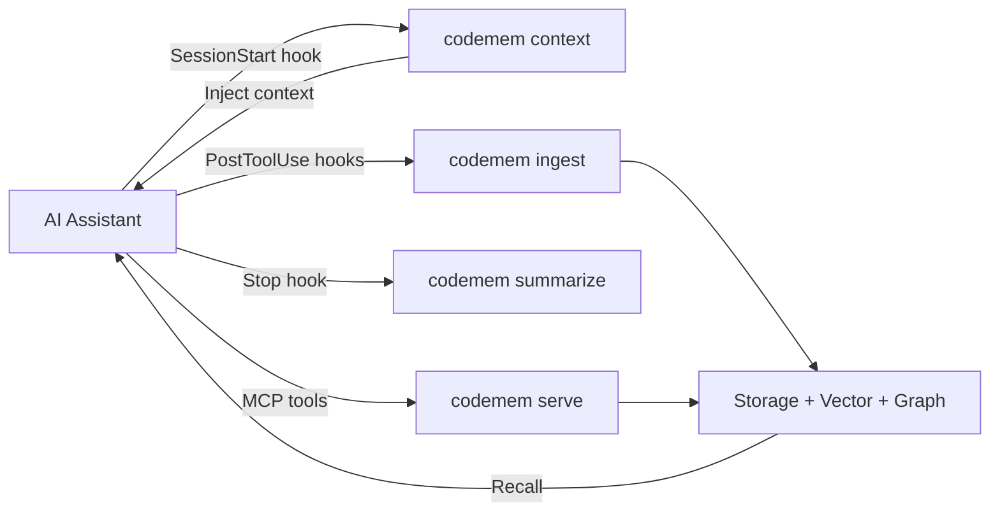

# Codemem

[](https://github.com/cogniplex/codemem/actions/workflows/ci.yml)
[](https://codecov.io/gh/cogniplex/codemem)
[](https://crates.io/crates/codemem-cli)
[](LICENSE)

A standalone Rust memory engine for AI coding assistants. Single binary, zero runtime deps.

Codemem stores what your AI assistant discovers -- files read, symbols searched, edits made -- so repositories don't need re-exploring across sessions.

## Quick Start

### Install

```bash
# Shell (macOS/Linux)
curl -fsSL https://raw.githubusercontent.com/cogniplex/codemem/main/install.sh | sh

# Homebrew
brew install cogniplex/tap/codemem

# Cargo
cargo install codemem-cli
```

Or download a prebuilt binary from [Releases](https://github.com/cogniplex/codemem/releases).

| Platform | Architecture | Binary |
|----------|-------------|--------|
| macOS | ARM64 (Apple Silicon) | `codemem-macos-arm64.tar.gz` |
| Linux | x86_64 | `codemem-linux-amd64.tar.gz` |
| Linux | ARM64 | `codemem-linux-arm64.tar.gz` |

### Initialize

```bash
cd your-project
codemem init
```

Downloads the local embedding model (~440MB, one-time), registers lifecycle hooks, and configures the MCP server for your AI assistant. Automatically detects Claude Code, Cursor, and Windsurf.

### That's it

Codemem now automatically captures context, injects prior knowledge at session start, and provides 33 MCP tools to your assistant.

### Map your codebase (optional)

Index your codebase to build a structural knowledge graph with call relationships, dependency edges, and PageRank-based importance scores:

```bash
codemem index
```

Then use the built-in [code-mapper agent](examples/agents/code-mapper.md) to analyze architecture, detect clusters, and store insights:

```
# In your AI assistant, the code-mapper agent runs these MCP tools:
get_pagerank { "top_k": 20 }              # Find most important symbols
get_clusters { "resolution": 1.0 }        # Detect architectural modules
get_impact { "qualified_name": "...", "depth": 2 }  # Blast radius analysis
search_code { "query": "database connection" }       # Semantic code search
```

See [`examples/agents/code-mapper.md`](examples/agents/code-mapper.md) for the full workflow.

## Key Features

- **Graph-vector hybrid architecture** -- HNSW vector search (768-dim) + petgraph knowledge graph with 25 algorithms (PageRank, Louvain, betweenness centrality, BFS/DFS, and more)
- **33 MCP tools** -- Memory CRUD, graph traversal, code search, consolidation, impact analysis, and pattern detection over JSON-RPC
- **4 lifecycle hooks** -- Automatic context injection (SessionStart), prompt capture (UserPromptSubmit), observation capture (PostToolUse), and session summaries (Stop)
- **9-component hybrid scoring** -- Vector similarity, graph strength, BM25 token overlap, temporal alignment, tag matching, importance, confidence, and recency
- **Code-aware indexing** -- tree-sitter structural extraction for 6 languages (Rust, TypeScript, Python, Go, C/C++, Java)
- **Contextual embeddings** -- Metadata and graph context enriched before embedding for higher recall precision
- **Pluggable embeddings** -- Candle (local BERT, default), Ollama, or any OpenAI-compatible API
- **Cross-session intelligence** -- Pattern detection, file hotspot tracking, decision chains, and session continuity
- **Memory consolidation** -- 4 neuroscience-inspired cycles: Decay, Creative/REM, Cluster, Forget
- **Real-time file watching** -- notify-based watcher with <50ms debounce and .gitignore support
- **Persistent config** -- TOML-based configuration at `~/.codemem/config.toml`
- **Production hardened** -- Zero `.unwrap()` in production code, safe concurrency, versioned schema migrations

## How It Works



1. **Passively captures** what your AI reads, searches, and edits via lifecycle hooks
2. **Actively recalls** relevant context via MCP tools with 9-component hybrid scoring
3. **Injects context** at session start so your assistant picks up where it left off

### Hybrid scoring

| Component | Weight |
|-----------|--------|
| Vector similarity | 25% |
| Graph strength (PageRank + betweenness + degree + cluster) | 25% |
| BM25 token overlap | 15% |
| Temporal | 10% |
| Tags | 10% |
| Importance | 5% |
| Confidence | 5% |
| Recency | 5% |

Weights are configurable at runtime via the `set_scoring_weights` MCP tool and persist in `config.toml`.

## Configuration

### Embedding providers

By default, Codemem runs a local BERT model (no API key needed). To use a remote provider:

```bash
# Ollama (local server)
export CODEMEM_EMBED_PROVIDER=ollama

# OpenAI-compatible (works with Voyage AI, Together, Azure, etc.)
export CODEMEM_EMBED_PROVIDER=openai
export CODEMEM_EMBED_URL=https://api.voyageai.com/v1
export CODEMEM_EMBED_MODEL=voyage-3
export CODEMEM_EMBED_API_KEY=pa-...
```

### Observation compression

Optionally compress raw tool observations via LLM before storage:

```bash
export CODEMEM_COMPRESS_PROVIDER=ollama   # or openai, anthropic
```

### Persistent config

Scoring weights, vector/graph tuning, and storage settings persist in `~/.codemem/config.toml`. Partial configs merge with defaults.

## MCP Tools

33 tools organized by category. See [MCP Tools Reference](docs/mcp-tools.md) for full API documentation.

| Category | Tools |
|----------|-------|
| Core Memory (8) | `store_memory`, `recall_memory`, `update_memory`, `delete_memory`, `associate_memories`, `graph_traverse`, `codemem_stats`, `codemem_health` |
| Structural Index (10) | `index_codebase`, `search_symbols`, `get_symbol_info`, `get_dependencies`, `get_impact`, `get_clusters`, `get_cross_repo`, `get_pagerank`, `search_code`, `set_scoring_weights` |
| Export/Import (2) | `export_memories`, `import_memories` |
| Recall & Namespace (4) | `recall_with_expansion`, `list_namespaces`, `namespace_stats`, `delete_namespace` |
| Consolidation (5) | `consolidate_decay`, `consolidate_creative`, `consolidate_cluster`, `consolidate_forget`, `consolidation_status` |
| Impact & Patterns (4) | `recall_with_impact`, `get_decision_chain`, `detect_patterns`, `pattern_insights` |

## CLI

```
codemem init          # Initialize project (model + hooks + MCP)
codemem search        # Search memories
codemem stats         # Database statistics
codemem serve         # Start MCP server (JSON-RPC stdio)
codemem index         # Index codebase with tree-sitter
codemem consolidate   # Run consolidation cycles
codemem viz           # Interactive memory graph dashboard
codemem watch         # Real-time file watcher
codemem export/import # Backup and restore
codemem sessions      # Session management (list, start, end)
```

See [CLI Reference](docs/cli-reference.md) for full usage.

## Performance

| Operation | Target |
|-----------|--------|
| HNSW search k=10 (100K vectors) | < 2ms |
| Embedding (single sentence) | < 50ms |
| Embedding (cache hit) | < 0.01ms |
| Graph BFS depth=2 | < 1ms |
| Hook ingest (Read) | < 200ms |

## Documentation

- [Architecture](docs/architecture.md) -- System design, data flow diagrams, storage schema
- [MCP Tools Reference](docs/mcp-tools.md) -- All 33 tools with parameters and examples
- [CLI Reference](docs/cli-reference.md) -- All 15 commands
- [Comparison](docs/comparison.md) -- vs Mem0, Zep/Graphiti, Letta, claude-mem, and more

## Building from Source

```bash
git clone https://github.com/cogniplex/codemem.git
cd codemem
cargo build --release          # Optimized binary at target/release/codemem
cargo test --workspace         # Run all 415 tests
cargo bench                    # Criterion benchmarks
```

12-crate Cargo workspace. See [CONTRIBUTING.md](CONTRIBUTING.md) for development guidelines.

## Research and Inspirations

Codemem builds on ideas from several research papers, blog posts, and open-source projects.

<details>
<summary>Papers</summary>

| Paper | Venue | Key Contribution |
|-------|-------|-----------------|
| [HippoRAG](https://arxiv.org/abs/2405.14831) | NeurIPS 2024 | Neurobiologically-inspired long-term memory using LLMs + knowledge graphs + Personalized PageRank. Up to 20% improvement on multi-hop QA. |
| [From RAG to Memory](https://arxiv.org/abs/2502.14802) | ICML 2025 | Non-parametric continual learning for LLMs (HippoRAG 2). 7% improvement in associative memory tasks. |
| [A-MEM](https://arxiv.org/abs/2502.12110) | 2025 | Zettelkasten-inspired agentic memory with dynamic indexing, linking, and memory evolution. |
| [MemGPT](https://arxiv.org/abs/2310.08560) | ICLR 2024 | OS-inspired hierarchical memory tiers for LLMs -- self-editing memory via function calls. |
| [MELODI](https://arxiv.org/abs/2410.03156) | Google DeepMind 2024 | Hierarchical short-term + long-term memory compression. 8x memory footprint reduction. |
| [ReadAgent](https://arxiv.org/abs/2402.09727) | Google DeepMind 2024 | Human-inspired reading agent with episodic gist memories for 20x context extension. |
| [LoCoMo](https://arxiv.org/abs/2402.17753) | ACL 2024 | Benchmark for evaluating very long-term conversational memory (300-turn, 9K-token conversations). |
| [Mem0](https://arxiv.org/abs/2504.19413) | 2025 | Production-ready AI agents with scalable long-term memory. 26% accuracy improvement over OpenAI Memory. |
| [Zep](https://arxiv.org/abs/2501.13956) | 2025 | Temporal knowledge graph architecture for agent memory with bi-temporal data model. |
| [Memory in the Age of AI Agents](https://arxiv.org/abs/2512.13564) | Survey 2024 | Comprehensive taxonomy of agent memory: factual, experiential, working memory. |
| [AriGraph](https://arxiv.org/abs/2407.04363) | 2024 | Episodic + semantic memory in knowledge graphs for LLM agent exploration. |

</details>

<details>
<summary>Blog posts and techniques</summary>

- [Contextual Retrieval](https://www.anthropic.com/news/contextual-retrieval) (Anthropic, 2024) -- Prepending chunk-specific context before embedding reduces failed retrievals by 49%. Codemem adapts this as template-based contextual enrichment using metadata + graph relationships.
- [Contextual Embeddings Cookbook](https://platform.claude.com/cookbook/capabilities-contextual-embeddings-guide) (Anthropic) -- Implementation guide for contextual embeddings with prompt caching.

</details>

<details>
<summary>Open-source projects</summary>

- [AutoMem](https://automem.ai/) -- Graph-vector hybrid memory achieving 90.53% on LoCoMo. Direct inspiration for Codemem's hybrid scoring and consolidation cycles.
- [claude-mem](https://github.com/thedotmack/claude-mem) -- Persistent memory compression via Claude Agent SDK. Inspired lifecycle hooks and observation compression.
- [Mem0](https://github.com/mem0ai/mem0) -- Production memory layer for AI (47K+ stars). Informed memory type design.
- [Zep/Graphiti](https://github.com/getzep/graphiti) -- Temporal knowledge graph engine. Inspired graph persistence model.
- [Letta](https://github.com/letta-ai/letta) (MemGPT) -- Stateful AI agents with self-editing memory.
- [Cognee](https://github.com/topoteretes/cognee) -- Knowledge graph memory via triplet extraction.
- [claude-context](https://github.com/zilliztech/claude-context) -- AST-aware code search via MCP (by Zilliz).

</details>

See [docs/comparison.md](docs/comparison.md) for detailed feature comparisons.

## License

[Apache 2.0](LICENSE)
