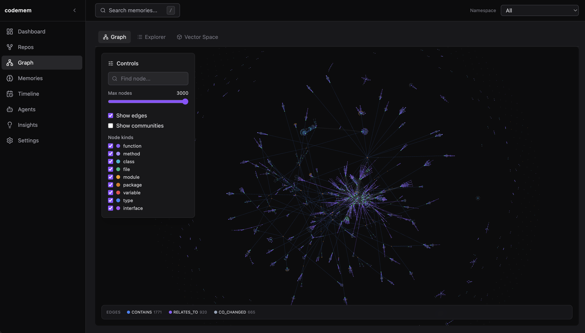
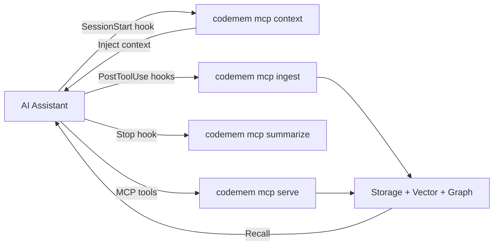

# Codemem

[](https://github.com/cogniplex/codemem/actions/workflows/ci.yml)
[](https://codecov.io/gh/cogniplex/codemem)
[](https://crates.io/crates/codemem)
[](LICENSE)

A standalone Rust memory engine for AI coding assistants. Single binary, zero runtime deps.

Codemem stores what your AI assistant discovers -- files read, symbols searched, edits made -- so repositories don't need re-exploring across sessions. Optionally enriches the graph with compiler-grade cross-references via [SCIP](https://scip.dev) indexers.



---

## The Problem

Your AI assistant explores 50 files, traces call chains, makes architectural decisions -- then the session ends. Next session? It starts from scratch. Every. Single. Time.

Worse: it edits `UserService.validate()` without knowing that 47 downstream functions depend on that return type. It refactors a module with no memory of why the previous approach was chosen.

**The assistant needs a knowledge graph -- not more text.**

## What Codemem Does

Codemem builds a persistent, queryable knowledge graph of your codebase and your assistant's interactions with it. Commits become nodes. Symbols have typed edges. Decisions leave traces. And your assistant picks up exactly where it left off.

```bash
# One command. That's it.
cd your-project && codemem init
```

From that point on, Codemem silently captures context, injects prior knowledge at session start, and provides 32 MCP tools to your assistant -- including temporal queries, diff review, and blast radius analysis.

---

## Quick Start

### Install

```bash
# Shell (macOS/Linux)
curl -fsSL https://raw.githubusercontent.com/cogniplex/codemem/main/install.sh | sh

# Homebrew
brew install cogniplex/tap/codemem

# Cargo
cargo install codemem
```

Or download a prebuilt binary from [Releases](https://github.com/cogniplex/codemem/releases).

| Platform | Architecture | Binary |
|----------|-------------|--------|
| macOS | ARM64 (Apple Silicon) | `codemem-macos-arm64.tar.gz` |
| Linux | x86_64 | `codemem-linux-amd64.tar.gz` |
| Linux | ARM64 | `codemem-linux-arm64.tar.gz` |

### Initialize

```bash
cd your-project
codemem init
```

Downloads the local embedding model (~440MB, one-time), registers lifecycle hooks, and configures the MCP server for your AI assistant. Automatically detects Claude Code, Cursor, and Windsurf.

### That's it

Codemem now automatically captures context, injects prior knowledge at session start, and provides 32 MCP tools to your assistant.

### Map your codebase (optional)

Run the full analysis pipeline -- indexes your codebase with tree-sitter, enriches the graph with SCIP cross-references (if indexers are installed), computes PageRank, and detects architectural clusters:

```bash
codemem analyze
```

Then launch the code-mapper agent to do deep, agent-driven analysis -- it spawns a team of specialized agents that traverse the knowledge graph, discover patterns, and store architectural insights:

```bash
claude --agent code-mapper
```

See [Index & Enrich Pipeline](docs/pipeline.md) for what happens under the hood.

### SCIP enrichment (optional, recommended)

[SCIP](https://scip.dev) (Source Code Intelligence Protocol) gives codemem compiler-grade cross-references -- every call, import, type reference, and override in your codebase, with zero false positives. `codemem analyze` auto-detects installed indexers and runs them automatically.

**Install the indexer for your language:**

| Language | Indexer | Install |
|----------|---------|---------|
| Rust | rust-analyzer | `rustup component add rust-analyzer` |
| TypeScript/JavaScript | scip-typescript | `npm install -g @sourcegraph/scip-typescript` |
| Python | scip-python | `npm install -g @sourcegraph/scip-python` |
| Go | scip-go | `go install github.com/sourcegraph/scip-go/cmd/scip-go@latest` |
| Java/Kotlin | scip-java | [scip-java releases](https://sourcegraph.github.io/scip-java/) |
| C# | scip-dotnet | `dotnet tool install --global scip-dotnet` |
| Ruby | scip-ruby | `gem install scip-ruby` |

Codemem detects languages from manifest files (`Cargo.toml`, `package.json`, `pyproject.toml`, `go.mod`, etc.) and checks PATH for the corresponding indexer. If found, SCIP edges are fused with ast-grep pattern edges -- when both sources agree on the same edge, their confidence scores sum (0.10 + 0.15 = 0.25), producing higher-fidelity graph connections.

**Configure via `~/.codemem/config.toml`:**

```toml
[scip]
enabled = true                    # Master switch (default: true)
auto_detect_indexers = true       # Check PATH for available indexers
cache_index = true                # Cache .scip files between runs
cache_ttl_hours = 24              # Re-index if cache older than this
create_external_nodes = true      # Create ext: nodes for dependency symbols
store_docs_as_memories = true     # Attach hover docs as memories
hierarchical_containment = true   # Build nested containment tree
collapse_intra_class_edges = true # Fold intra-class calls into parent metadata

[scip.fan_out_limits]
module = 200     # Modules can be widely imported
class = 50       # Classes referenced moderately
function = 30    # Functions and methods less so
method = 30

# Override auto-detected indexer commands per language:
# [scip.indexers]
# rust = "rust-analyzer scip ."
# typescript = "scip-typescript index --infer-tsconfig"
```

No SCIP indexer installed? No problem -- codemem works fine without it. You just get ast-grep pattern edges (confidence 0.10) instead of compiler-grade ones.

---

## What You Get

### Know What Breaks Before You Change It

Pipe a diff through `codemem review` and get a full blast radius analysis -- changed symbols mapped to direct and transitive dependents, risk scores, and potentially missing changes -- before you merge.

```bash
git diff main..HEAD | codemem review --format text
```

```
Risk Score: 7.2 (high)
Changed Symbols: 3
  sym:AuthService::validate  (PageRank: 0.032)
  sym:AuthService::refresh   (PageRank: 0.018)
  sym:TokenStore::revoke     (PageRank: 0.011)
Direct Dependents: 12
Transitive Dependents: 47
Potentially Missing Changes:
  sym:SessionMiddleware::check — calls validate(), may need update
```

Also available as the `review_diff` MCP tool for in-assistant use.

### Travel Through Time

Every commit becomes a node in the graph. Query what changed, when, and what drifted:

```bash
# "What changed in the last two weeks?"
# → MCP tool: what_changed(from, to)

# "Show me the graph as it was on March 1st"
# → MCP tool: graph_at_time(at)

# "Which high-centrality files haven't been touched in 90 days?"
# → MCP tool: find_stale_files(stale_days=90)

# "Detect architectural drift between Q1 and Q2"
# → MCP tool: detect_drift(from, to)

# "What's the commit history for this function?"
# → MCP tool: symbol_history(node_id)
```

5 temporal MCP tools give your assistant full time-travel capability across the codebase, including graph snapshots, stale file detection, and architectural drift analysis.

### Cross-Session Intelligence

Your assistant picks up where it left off. Decisions, patterns, and insights persist across sessions with 9-component hybrid scoring:

| Component | Weight | What it measures |
|-----------|--------|-----------------|
| Vector similarity | 25% | Semantic closeness to query |
| Graph strength | 20% | PageRank + betweenness + degree + cluster bonus |
| BM25 token overlap | 15% | Keyword matching with code-aware tokenizer |
| Scope context | 10% | Branch/repo/user awareness |
| Temporal | 10% | Temporal alignment with query context |
| Importance | 10% | Stored importance score |
| Confidence | 10% | Edge confidence and source reliability |
| Tag matching | 5% | Query-derived tags vs memory tags |
| Recency | 5% | Boost for recently accessed memories |

Weights are configurable via `codemem config set scoring.<key> <value>`.

### Cross-Service API Detection

Codemem parses OpenAPI/Swagger specs, AsyncAPI specs, and detects event-driven patterns (Kafka, RabbitMQ, Redis, SQS, SNS, NATS) to build cross-service edges:

- `HttpCalls` -- REST calls between services
- `PublishesTo` -- Event publish relationships
- `SubscribesTo` -- Event subscribe relationships

### Memory That Expires

Session-scoped memories and stale enrichments auto-expire. Set TTL on any memory:

```json
{
  "name": "store_memory",
  "arguments": {
    "content": "Temporary note: API key rotates Friday",
    "ttl_hours": 72
  }
}
```

Configure defaults in `~/.codemem/config.toml`:

```toml
[memory]
default_session_ttl_hours = 168          # 7 days for session memories
expire_enrichments_on_reindex = true     # Auto-expire stale analysis
```

### Pluggable Everything

**Embedding providers** -- run fully offline or use any API:

```bash
# Local (default, no API key needed)
export CODEMEM_EMBED_PROVIDER=candle

# Ollama (local server)
export CODEMEM_EMBED_PROVIDER=ollama

# OpenAI-compatible (Voyage AI, Together, Azure, etc.)
export CODEMEM_EMBED_PROVIDER=openai
export CODEMEM_EMBED_URL=https://api.voyageai.com/v1
export CODEMEM_EMBED_MODEL=voyage-3
export CODEMEM_EMBED_API_KEY=pa-...

# Google Gemini
export CODEMEM_EMBED_PROVIDER=gemini
export CODEMEM_EMBED_API_KEY=AIza...
```

**Configurable model, precision, and batch size:**

```toml
[embedding]
provider = "candle"
model = "BAAI/bge-base-en-v1.5"    # Any HuggingFace BERT model
dtype = "f16"                       # f32, f16, bf16 — half precision halves memory
batch_size = 16                     # Tune for GPU memory / throughput
dimensions = 768                    # Auto-detected for Candle
cache_capacity = 10000              # LRU embedding cache
```

**Storage backends** -- currently SQLite (local), with trait-object abstractions ready for Postgres+pgvector and remote graph backends:

```toml
[storage]
backend = "sqlite"       # or "postgres" (future)

[vector]
backend = "hnsw"         # or "pgvector", "qdrant" (future)

[graph]
backend = "inmemory"     # or "neo4j", "postgres" (future)
```

---

## Key Features

- **Graph-vector hybrid architecture** -- HNSW vector search (768-dim) + petgraph knowledge graph (PageRank, Louvain community detection, betweenness centrality, BFS/DFS, SCC, topological sort, and more)
- **Temporal graph layer** -- Commits and PRs as graph nodes, ModifiedBy edges, `valid_from`/`valid_to` timestamps on all nodes. 5 temporal query tools: what_changed, graph_at_time, find_stale_files, detect_drift, symbol_history
- **Diff-aware code review** -- Map changed lines to graph symbols, compute multi-hop blast radius with risk scoring, surface relevant memories and potentially missing changes. Available as CLI (`codemem review`) and MCP tool (`review_diff`)
- **Scope context** -- Repo/branch/user-aware memory scoping. Feature branch overlay resolution against base branch. Memories and graph data tagged with `repo` and `git_ref` for team-ready filtering
- **SCIP integration** -- Compiler-grade cross-references via [SCIP](https://scip.dev) indexers (rust-analyzer, scip-typescript, scip-python, scip-go, scip-java, and more). Multi-layer edge fusion with ast-grep: when both sources agree, confidence scores sum. Auto-detects installed indexers, caches results, and cleans up stale nodes on re-index
- **Cross-service API detection** -- Parses OpenAPI/Swagger, AsyncAPI specs, and event frameworks (Kafka, RabbitMQ, Redis, SQS, SNS, NATS). Creates HttpCalls, PublishesTo, SubscribesTo edges between services
- **32 MCP tools** -- Memory CRUD, self-editing (refine/split/merge), graph traversal, code search, temporal queries, diff review, consolidation, impact analysis, session context, pattern detection over JSON-RPC
- **9 lifecycle hooks** -- Automatic context injection (SessionStart), prompt capture (UserPromptSubmit), observation capture (PostToolUse), error tracking (PostToolUseFailure), session summaries (Stop), subagent capture (SubagentStart/Stop), clean close (SessionEnd), and pre-compaction checkpoint (PreCompact)
- **9-component hybrid scoring** -- Vector similarity, graph strength, BM25 token overlap, scope context, temporal alignment, tag matching, importance, confidence, and recency
- **Memory expiration** -- Optional TTL on memories with opportunistic cleanup. Session memories auto-expire (configurable). Stale enrichments expire on file reindex
- **Code-aware indexing** -- tree-sitter structural extraction for 14 languages (Rust, TypeScript/JS/JSX, Python, Go, C/C++, Java, Ruby, C#, Kotlin, Swift, PHP, Scala, HCL/Terraform) with manifest parsing (Cargo.toml, package.json, go.mod, pyproject.toml)
- **Contextual embeddings** -- Metadata and graph context enriched before embedding for higher recall precision
- **Pluggable embeddings** -- Candle (local BERT, default), Ollama, OpenAI-compatible APIs, or Google Gemini. Configurable model, dtype (f32/f16/bf16), and batch size
- **Cross-session intelligence** -- Pattern detection, file hotspot tracking, decision chains, and session continuity
- **Memory consolidation** -- 5 neuroscience-inspired cycles: Decay (power-law), Creative/REM (semantic KNN), Cluster (cosine + union-find), Summarize (LLM-powered), Forget
- **Self-editing memory** -- Refine, split, and merge memories with full provenance tracking via temporal graph edges
- **Pluggable storage backends** -- Trait-object abstractions for vector (VectorBackend), graph (GraphBackend), and storage (StorageBackend). SQLite + usearch + petgraph today, ready for Postgres + pgvector + Neo4j
- **Operational metrics** -- Per-tool latency percentiles (p50/p95/p99), call counters, and gauges via `codemem_status` tool
- **Real-time file watching** -- notify-based watcher with <50ms debounce and .gitignore support
- **Persistent config** -- TOML-based configuration at `~/.codemem/config.toml`
- **Production hardened** -- Zero `.unwrap()` in production code, safe concurrency, versioned schema migrations

## Benchmarks

Although codemem is designed for code exploration memory (not generic conversational recall), it scores competitively on standard memory benchmarks:

| Benchmark | Score | Notes |
|-----------|-------|-------|
| [LoCoMo](bench/locomo/) (ACL 2024) | **91.64%** | vs 90.53% published SOTA -- stricter conditions: recall limit 10, no evidence oracle, no embedding fallback |
| [LongMemEval](bench/longmemeval/) (ICLR 2025) | **70%** | vs 71.2% Zep, 82.4% oracle -- recall limit 10, GPT-4o judge |

Both benchmarks use stricter conditions than published baselines: recall limit of 10 (vs 50-100), no evidence oracle, no embedding fallback. Both were run with OpenAI text-embedding-3-small. With the built-in local BERT model (BAAI/bge-base-en-v1.5), LoCoMo scores 89.58% -- a ~2% gap that graph expansion closes entirely (91.49% for both models in codemem-graph mode). Higher scores are achievable with better embedding models without any architectural changes.

Running with Ollama (e.g. `nomic-embed-text` or `mxbai-embed-large`) typically yields significantly higher benchmark scores than the built-in Candle model, while still keeping everything local.

See [bench/locomo/](bench/locomo/) and [bench/longmemeval/](bench/longmemeval/) for methodology, reproduction steps, and detailed breakdowns.

## How It Works


```mermaid
graph LR
    A[AI Assistant] -->|SessionStart hook| B[codemem mcp context]
    A -->|PostToolUse hooks| C[codemem mcp ingest]
    A -->|Stop hook| E[codemem mcp summarize]
    A -->|MCP tools| D[codemem mcp serve]
    B -->|Inject context| A
    C --> F[Storage + Vector + Graph]
    D --> F
    F -->|Recall| A
```

1. **Passively captures** what your AI reads, searches, and edits via 9 lifecycle hooks
2. **Actively recalls** relevant context via MCP tools with 9-component hybrid scoring
3. **Injects context** at session start so your assistant picks up where it left off
4. **Reviews diffs** for blast radius before merging, with risk scoring and missing-change detection
5. **Tracks time** -- every commit becomes a graph node, enabling temporal queries and drift detection

## MCP Tools

32 tools organized by category. See [MCP Tools Reference](docs/mcp-tools.md) for full API documentation.

| Category | Tools |
|----------|-------|
| Memory CRUD (7) | `store_memory`, `recall`, `delete_memory`, `associate_memories`, `refine_memory`, `split_memory`, `merge_memories` |
| Graph & Structure (9) | `graph_traverse`, `summary_tree`, `codemem_status`, `search_code`, `get_symbol_info`, `get_symbol_graph`, `find_important_nodes`, `find_related_groups`, `get_cross_repo` |
| Node Analysis (2) | `get_node_memories`, `node_coverage` |
| Consolidation & Patterns (3) | `consolidate`, `detect_patterns`, `get_decision_chain` |
| Namespace (3) | `list_namespaces`, `namespace_stats`, `delete_namespace` |
| Session & Context (2) | `session_checkpoint`, `session_context` |
| Code Review (1) | `review_diff` |
| Temporal Queries (5) | `what_changed`, `graph_at_time`, `find_stale_files`, `detect_drift`, `symbol_history` |

## CLI

```
codemem init          # Initialize project (model + hooks + MCP)
codemem search        # Search memories
codemem stats         # Database statistics
codemem ui            # Open control plane UI (REST API + embedded React frontend)
codemem analyze       # Full pipeline: index + SCIP + enrich + PageRank + clusters
codemem review        # Diff-aware blast radius analysis (reads diff from stdin)
codemem consolidate   # Run consolidation cycles
codemem export/import # Backup and restore (JSONL, JSON, CSV, Markdown)
codemem sessions      # Session management (list, start, end)
codemem doctor        # Health checks on installation
codemem config        # Get/set configuration values
codemem migrate       # Run pending schema migrations
codemem mcp serve     # Start MCP server (JSON-RPC stdio, or --http for HTTP)
codemem mcp ingest    # Process hook payload from stdin
codemem mcp context   # SessionStart hook (+ 7 more lifecycle hooks)
```

See [CLI Reference](docs/cli-reference.md) for full usage.

## Configuration

### Observation compression

Optionally compress raw tool observations via LLM before storage:

```bash
export CODEMEM_COMPRESS_PROVIDER=ollama   # or openai, anthropic
```

### Persistent config

Scoring weights, vector/graph tuning, embedding provider, memory expiration, and storage settings persist in `~/.codemem/config.toml`. Partial configs merge with defaults.

## Performance

| Operation | Target |
|-----------|--------|
| HNSW search k=10 (100K vectors) | < 2ms |
| Embedding (single sentence) | < 50ms |
| Embedding (cache hit) | < 0.01ms |
| Graph BFS depth=2 | < 1ms |
| Hook ingest (Read) | < 200ms |

## Documentation

- [Architecture](docs/architecture.md) -- System design, data flow diagrams, storage schema
- [Index & Enrich Pipeline](docs/pipeline.md) -- Step-by-step data flow from source files to annotated graph
- [MCP Tools Reference](docs/mcp-tools.md) -- All 32 tools with parameters and examples
- [CLI Reference](docs/cli-reference.md) -- All CLI commands with flags and examples
- [Comparison](docs/comparison.md) -- vs Mem0, Zep/Graphiti, Letta, claude-mem, and more

## Building from Source

```bash
git clone https://github.com/cogniplex/codemem.git
cd codemem
cargo build --release          # Optimized binary at target/release/codemem
cargo test --workspace         # Run all tests
cargo bench                    # Criterion benchmarks
```

6-crate Cargo workspace. See [CONTRIBUTING.md](CONTRIBUTING.md) for development guidelines.

## Research and Inspirations

Codemem builds on ideas from several research papers, blog posts, and open-source projects.

<details>
<summary>Papers</summary>

| Paper | Venue | Key Contribution |
|-------|-------|-----------------|
| [HippoRAG](https://arxiv.org/abs/2405.14831) | NeurIPS 2024 | Neurobiologically-inspired long-term memory using LLMs + knowledge graphs + Personalized PageRank. Up to 20% improvement on multi-hop QA. |
| [From RAG to Memory](https://arxiv.org/abs/2502.14802) | ICML 2025 | Non-parametric continual learning for LLMs (HippoRAG 2). 7% improvement in associative memory tasks. |
| [A-MEM](https://arxiv.org/abs/2502.12110) | 2025 | Zettelkasten-inspired agentic memory with dynamic indexing, linking, and memory evolution. |
| [MemGPT](https://arxiv.org/abs/2310.08560) | ICLR 2024 | OS-inspired hierarchical memory tiers for LLMs -- self-editing memory via function calls. |
| [MELODI](https://arxiv.org/abs/2410.03156) | Google DeepMind 2024 | Hierarchical short-term + long-term memory compression. 8x memory footprint reduction. |
| [ReadAgent](https://arxiv.org/abs/2402.09727) | Google DeepMind 2024 | Human-inspired reading agent with episodic gist memories for 20x context extension. |
| [LoCoMo](https://arxiv.org/abs/2402.17753) | ACL 2024 | Benchmark for evaluating very long-term conversational memory (300-turn, 9K-token conversations). |
| [Mem0](https://arxiv.org/abs/2504.19413) | 2025 | Production-ready AI agents with scalable long-term memory. 26% accuracy improvement over OpenAI Memory. |
| [Zep](https://arxiv.org/abs/2501.13956) | 2025 | Temporal knowledge graph architecture for agent memory with bi-temporal data model. |
| [Memory in the Age of AI Agents](https://arxiv.org/abs/2512.13564) | Survey 2024 | Comprehensive taxonomy of agent memory: factual, experiential, working memory. |
| [AriGraph](https://arxiv.org/abs/2407.04363) | 2024 | Episodic + semantic memory in knowledge graphs for LLM agent exploration. |

</details>

<details>
<summary>Blog posts and techniques</summary>

- [Contextual Retrieval](https://www.anthropic.com/news/contextual-retrieval) (Anthropic, 2024) -- Prepending chunk-specific context before embedding reduces failed retrievals by 49%. Codemem adapts this as template-based contextual enrichment using metadata + graph relationships.
- [Contextual Embeddings Cookbook](https://platform.claude.com/cookbook/capabilities-contextual-embeddings-guide) (Anthropic) -- Implementation guide for contextual embeddings with prompt caching.

</details>

<details>
<summary>Open-source projects</summary>

- [AutoMem](https://automem.ai/) -- Graph-vector hybrid memory achieving 90.53% on LoCoMo. Direct inspiration for Codemem's hybrid scoring and consolidation cycles.
- [claude-mem](https://github.com/thedotmack/claude-mem) -- Persistent memory compression via Claude Agent SDK. Inspired lifecycle hooks and observation compression.
- [Mem0](https://github.com/mem0ai/mem0) -- Production memory layer for AI (47K+ stars). Informed memory type design.
- [Zep/Graphiti](https://github.com/getzep/graphiti) -- Temporal knowledge graph engine. Inspired graph persistence model.
- [Letta](https://github.com/letta-ai/letta) (MemGPT) -- Stateful AI agents with self-editing memory.
- [Cognee](https://github.com/topoteretes/cognee) -- Knowledge graph memory via triplet extraction.
- [claude-context](https://github.com/zilliztech/claude-context) -- AST-aware code search via MCP (by Zilliz).

</details>

See [docs/comparison.md](docs/comparison.md) for detailed feature comparisons.

## License

[Apache 2.0](LICENSE)
