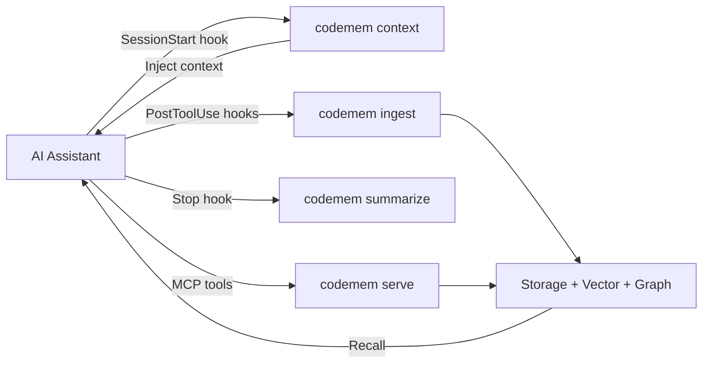

# Codemem

[](https://github.com/cogniplex/codemem/actions/workflows/ci.yml)
[](https://codecov.io/gh/cogniplex/codemem)
[](https://crates.io/crates/codemem)
[](LICENSE)

A standalone Rust memory engine for AI coding assistants. Single binary, zero runtime deps.

Codemem stores what your AI assistant discovers -- files read, symbols searched, edits made -- so repositories don't need re-exploring across sessions.


## Quick Start

### Install

```bash
# Shell (macOS/Linux)
curl -fsSL https://raw.githubusercontent.com/cogniplex/codemem/main/install.sh | sh

# Homebrew
brew install cogniplex/tap/codemem

# Cargo
cargo install codemem
```

Or download a prebuilt binary from [Releases](https://github.com/cogniplex/codemem/releases).

| Platform | Architecture | Binary |
|----------|-------------|--------|
| macOS | ARM64 (Apple Silicon) | `codemem-macos-arm64.tar.gz` |
| Linux | x86_64 | `codemem-linux-amd64.tar.gz` |
| Linux | ARM64 | `codemem-linux-arm64.tar.gz` |

### Initialize

```bash
cd your-project
codemem init
```

Downloads the local embedding model (~440MB, one-time), registers lifecycle hooks, and configures the MCP server for your AI assistant. Automatically detects Claude Code, Cursor, and Windsurf.

### That's it

Codemem now automatically captures context, injects prior knowledge at session start, and provides 32 MCP tools to your assistant.

### Map your codebase (optional)

Run the full analysis pipeline -- indexes your codebase with tree-sitter, runs 14 enrichment analyses (git history, complexity, security, architecture, etc.), computes PageRank, and detects architectural clusters:

```bash
codemem analyze
```

Then launch the [code-mapper agent](examples/agents/code-mapper.md) to do deep, agent-driven analysis -- it spawns a team of specialized agents that traverse the knowledge graph, discover patterns, and store architectural insights:

```bash
claude --agent code-mapper
```

See [Index & Enrich Pipeline](docs/pipeline.md) for what happens under the hood.

## Key Features

- **Graph-vector hybrid architecture** -- HNSW vector search (768-dim) + petgraph knowledge graph (PageRank, Louvain community detection, betweenness centrality, BFS/DFS, SCC, topological sort, and more)
- **32 MCP tools** -- Memory CRUD, self-editing (refine/split/merge), graph traversal, code search, enrichment pipeline (14 enrichment types), consolidation, impact analysis, session context, pattern detection over JSON-RPC
- **4 lifecycle hooks** -- Automatic context injection (SessionStart), prompt capture (UserPromptSubmit), observation capture (PostToolUse), and session summaries (Stop)
- **8-component hybrid scoring** -- Vector similarity, graph strength, BM25 token overlap, temporal alignment, tag matching, importance, confidence, and recency
- **Code-aware indexing** -- tree-sitter structural extraction for 14 languages (Rust, TypeScript/JS/JSX, Python, Go, C/C++, Java, Ruby, C#, Kotlin, Swift, PHP, Scala, HCL/Terraform) with manifest parsing (Cargo.toml, package.json, go.mod, pyproject.toml)
- **Contextual embeddings** -- Metadata and graph context enriched before embedding for higher recall precision
- **Pluggable embeddings** -- Candle (local BERT, default), Ollama, or any OpenAI-compatible API
- **Cross-session intelligence** -- Pattern detection, file hotspot tracking, decision chains, and session continuity
- **Memory consolidation** -- 5 neuroscience-inspired cycles: Decay (power-law), Creative/REM (semantic KNN), Cluster (cosine + union-find), Summarize (LLM-powered), Forget
- **Self-editing memory** -- Refine, split, and merge memories with full provenance tracking via temporal graph edges
- **Operational metrics** -- Per-tool latency percentiles (p50/p95/p99), call counters, and gauges via `codemem_status` tool
- **Real-time file watching** -- notify-based watcher with <50ms debounce and .gitignore support
- **Persistent config** -- TOML-based configuration at `~/.codemem/config.toml`
- **Production hardened** -- Zero `.unwrap()` in production code, safe concurrency, versioned schema migrations

## Benchmarks

Although codemem is designed for code exploration memory (not generic conversational recall), it scores competitively on standard memory benchmarks:

| Benchmark | Score | Notes |
|-----------|-------|-------|
| [LoCoMo](bench/locomo/) (ACL 2024) | **91.64%** | vs 90.53% published SOTA — stricter conditions: recall limit 10, no evidence oracle, no embedding fallback |
| [LongMemEval](bench/longmemeval/) (ICLR 2025) | **70%** | vs 71.2% Zep, 82.4% oracle — recall limit 10, GPT-4o judge |

Both benchmarks use stricter conditions than published baselines: recall limit of 10 (vs 50-100), no evidence oracle, no embedding fallback. Both were run with OpenAI text-embedding-3-small. With the built-in local BERT model (BAAI/bge-base-en-v1.5), LoCoMo scores 89.58% — a ~2% gap that graph expansion closes entirely (91.49% for both models in codemem-graph mode). Higher scores are achievable with better embedding models without any architectural changes.

See [bench/locomo/](bench/locomo/) and [bench/longmemeval/](bench/longmemeval/) for methodology, reproduction steps, and detailed breakdowns.

## How It Works


```mermaid
graph LR
    A[AI Assistant] -->|SessionStart hook| B[codemem context]
    A -->|PostToolUse hooks| C[codemem ingest]
    A -->|Stop hook| E[codemem summarize]
    A -->|MCP tools| D[codemem serve]
    B -->|Inject context| A
    C --> F[Storage + Vector + Graph]
    D --> F
    F -->|Recall| A
```

1. **Passively captures** what your AI reads, searches, and edits via lifecycle hooks
2. **Actively recalls** relevant context via MCP tools with 8-component hybrid scoring
3. **Injects context** at session start so your assistant picks up where it left off

### Hybrid scoring

| Component | Weight |
|-----------|--------|
| Vector similarity | 25% |
| Graph strength (PageRank + betweenness + degree + cluster) | 20% |
| BM25 token overlap | 15% |
| Temporal | 10% |
| Importance | 10% |
| Confidence | 10% |
| Tag matching | 5% |
| Recency | 5% |

Weights are configurable via `codemem config set scoring.<key> <value>` and persist in `~/.codemem/config.toml`.

## Configuration

### Embedding providers

By default, Codemem runs a local BERT model (no API key needed). To use a remote provider:

```bash
# Ollama (local server)
export CODEMEM_EMBED_PROVIDER=ollama

# OpenAI-compatible (works with Voyage AI, Together, Azure, etc.)
export CODEMEM_EMBED_PROVIDER=openai
export CODEMEM_EMBED_URL=https://api.voyageai.com/v1
export CODEMEM_EMBED_MODEL=voyage-3
export CODEMEM_EMBED_API_KEY=pa-...
```

### Observation compression

Optionally compress raw tool observations via LLM before storage:

```bash
export CODEMEM_COMPRESS_PROVIDER=ollama   # or openai, anthropic
```

### Persistent config

Scoring weights, vector/graph tuning, and storage settings persist in `~/.codemem/config.toml`. Partial configs merge with defaults.

## MCP Tools

26 tools organized by category. See [MCP Tools Reference](docs/mcp-tools.md) for full API documentation.

| Category | Tools |
|----------|-------|
| Memory CRUD (7) | `store_memory`, `recall`, `delete_memory`, `associate_memories`, `refine_memory`, `split_memory`, `merge_memories` |
| Graph & Structure (6) | `graph_traverse`, `summary_tree`, `codemem_status`, `search_code`, `get_symbol_info`, `get_symbol_graph` |
| Graph Analysis (5) | `find_important_nodes`, `find_related_groups`, `get_cross_repo`, `get_node_memories`, `node_coverage` |
| Consolidation & Patterns (3) | `consolidate`, `detect_patterns`, `get_decision_chain` |
| Namespace (3) | `list_namespaces`, `namespace_stats`, `delete_namespace` |
| Session & Context (2) | `session_checkpoint`, `session_context` |

## CLI

```
codemem init          # Initialize project (model + hooks + MCP)
codemem search        # Search memories
codemem stats         # Database statistics
codemem serve         # Start MCP server (JSON-RPC stdio)
codemem index         # Index codebase with tree-sitter
codemem consolidate   # Run consolidation cycles
codemem analyze       # Full pipeline: index + enrich + PageRank + clusters
codemem watch         # Real-time file watcher
codemem export/import # Backup and restore (JSONL, JSON, CSV, Markdown)
codemem sessions      # Session management (list, start, end)
codemem doctor        # Health checks on installation
codemem config        # Get/set configuration values
codemem migrate       # Run pending schema migrations
```

See [CLI Reference](docs/cli-reference.md) for full usage.

## Performance

| Operation | Target |
|-----------|--------|
| HNSW search k=10 (100K vectors) | < 2ms |
| Embedding (single sentence) | < 50ms |
| Embedding (cache hit) | < 0.01ms |
| Graph BFS depth=2 | < 1ms |
| Hook ingest (Read) | < 200ms |

## Documentation

- [Architecture](docs/architecture.md) -- System design, data flow diagrams, storage schema
- [Index & Enrich Pipeline](docs/pipeline.md) -- Step-by-step data flow from source files to annotated graph
- [MCP Tools Reference](docs/mcp-tools.md) -- All 32 tools with parameters and examples
- [CLI Reference](docs/cli-reference.md) -- All 19 commands
- [Comparison](docs/comparison.md) -- vs Mem0, Zep/Graphiti, Letta, claude-mem, and more

## Building from Source

```bash
git clone https://github.com/cogniplex/codemem.git
cd codemem
cargo build --release          # Optimized binary at target/release/codemem
cargo test --workspace         # Run all tests
cargo bench                    # Criterion benchmarks
```

6-crate Cargo workspace. See [CONTRIBUTING.md](CONTRIBUTING.md) for development guidelines.

## Research and Inspirations

Codemem builds on ideas from several research papers, blog posts, and open-source projects.

<details>
<summary>Papers</summary>

| Paper | Venue | Key Contribution |
|-------|-------|-----------------|
| [HippoRAG](https://arxiv.org/abs/2405.14831) | NeurIPS 2024 | Neurobiologically-inspired long-term memory using LLMs + knowledge graphs + Personalized PageRank. Up to 20% improvement on multi-hop QA. |
| [From RAG to Memory](https://arxiv.org/abs/2502.14802) | ICML 2025 | Non-parametric continual learning for LLMs (HippoRAG 2). 7% improvement in associative memory tasks. |
| [A-MEM](https://arxiv.org/abs/2502.12110) | 2025 | Zettelkasten-inspired agentic memory with dynamic indexing, linking, and memory evolution. |
| [MemGPT](https://arxiv.org/abs/2310.08560) | ICLR 2024 | OS-inspired hierarchical memory tiers for LLMs -- self-editing memory via function calls. |
| [MELODI](https://arxiv.org/abs/2410.03156) | Google DeepMind 2024 | Hierarchical short-term + long-term memory compression. 8x memory footprint reduction. |
| [ReadAgent](https://arxiv.org/abs/2402.09727) | Google DeepMind 2024 | Human-inspired reading agent with episodic gist memories for 20x context extension. |
| [LoCoMo](https://arxiv.org/abs/2402.17753) | ACL 2024 | Benchmark for evaluating very long-term conversational memory (300-turn, 9K-token conversations). |
| [Mem0](https://arxiv.org/abs/2504.19413) | 2025 | Production-ready AI agents with scalable long-term memory. 26% accuracy improvement over OpenAI Memory. |
| [Zep](https://arxiv.org/abs/2501.13956) | 2025 | Temporal knowledge graph architecture for agent memory with bi-temporal data model. |
| [Memory in the Age of AI Agents](https://arxiv.org/abs/2512.13564) | Survey 2024 | Comprehensive taxonomy of agent memory: factual, experiential, working memory. |
| [AriGraph](https://arxiv.org/abs/2407.04363) | 2024 | Episodic + semantic memory in knowledge graphs for LLM agent exploration. |

</details>

<details>
<summary>Blog posts and techniques</summary>

- [Contextual Retrieval](https://www.anthropic.com/news/contextual-retrieval) (Anthropic, 2024) -- Prepending chunk-specific context before embedding reduces failed retrievals by 49%. Codemem adapts this as template-based contextual enrichment using metadata + graph relationships.
- [Contextual Embeddings Cookbook](https://platform.claude.com/cookbook/capabilities-contextual-embeddings-guide) (Anthropic) -- Implementation guide for contextual embeddings with prompt caching.

</details>

<details>
<summary>Open-source projects</summary>

- [AutoMem](https://automem.ai/) -- Graph-vector hybrid memory achieving 90.53% on LoCoMo. Direct inspiration for Codemem's hybrid scoring and consolidation cycles.
- [claude-mem](https://github.com/thedotmack/claude-mem) -- Persistent memory compression via Claude Agent SDK. Inspired lifecycle hooks and observation compression.
- [Mem0](https://github.com/mem0ai/mem0) -- Production memory layer for AI (47K+ stars). Informed memory type design.
- [Zep/Graphiti](https://github.com/getzep/graphiti) -- Temporal knowledge graph engine. Inspired graph persistence model.
- [Letta](https://github.com/letta-ai/letta) (MemGPT) -- Stateful AI agents with self-editing memory.
- [Cognee](https://github.com/topoteretes/cognee) -- Knowledge graph memory via triplet extraction.
- [claude-context](https://github.com/zilliztech/claude-context) -- AST-aware code search via MCP (by Zilliz).

</details>

See [docs/comparison.md](docs/comparison.md) for detailed feature comparisons.

## License

[Apache 2.0](LICENSE)
