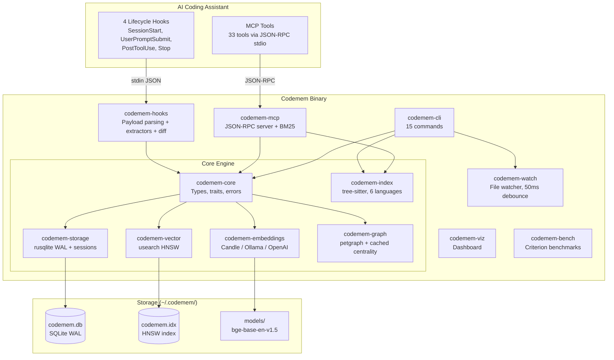
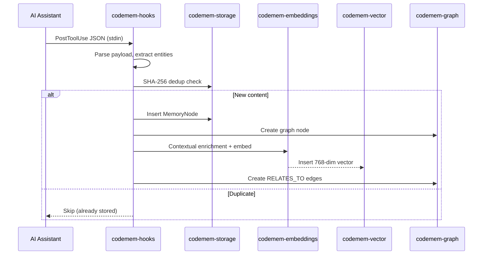
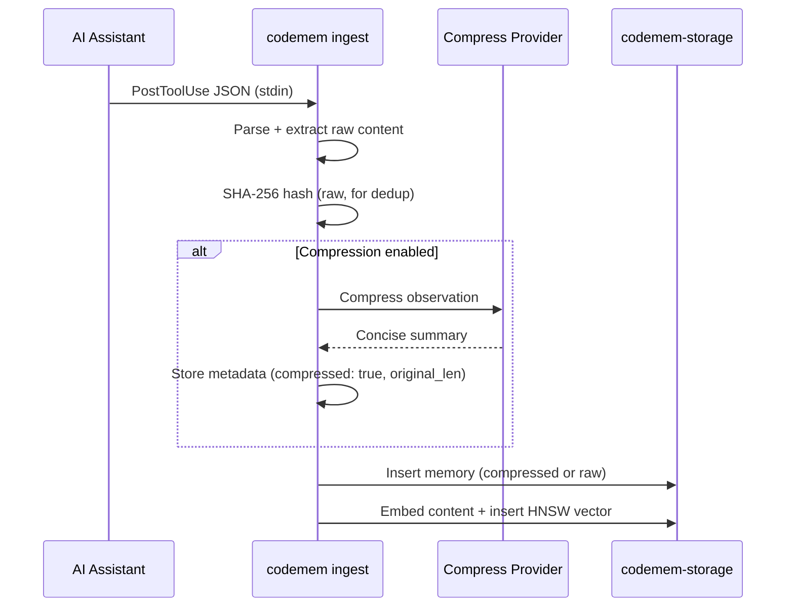
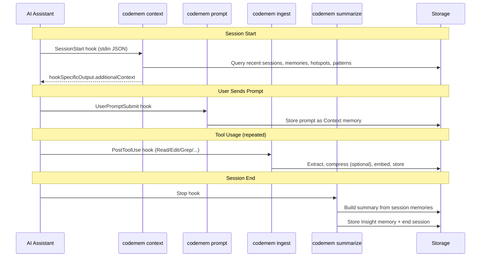
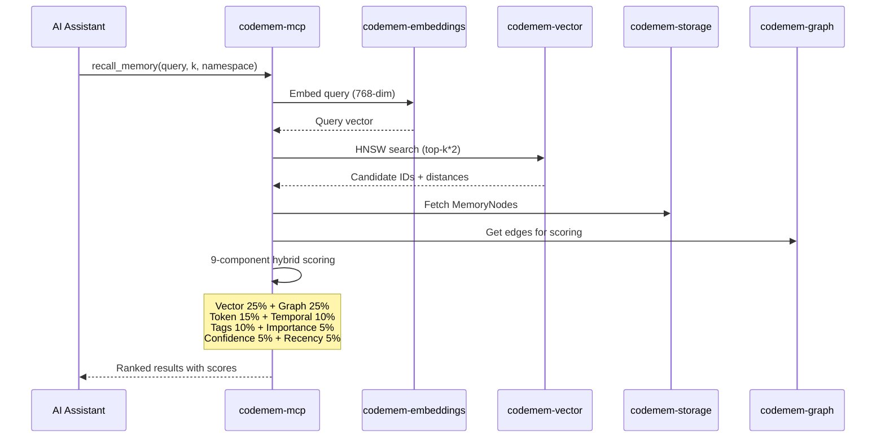
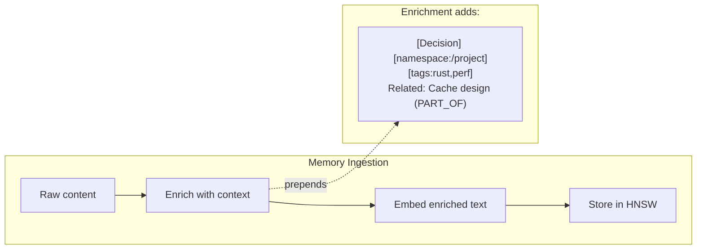
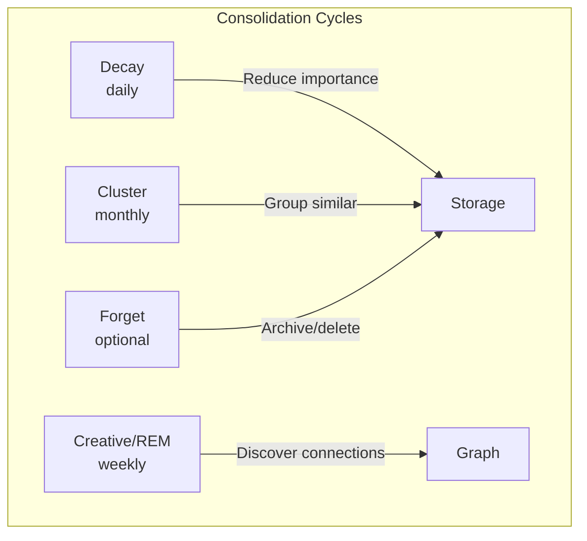

# Codemem Architecture

Codemem is a standalone Rust memory engine for AI coding assistants. A single binary (`cargo install codemem-cli`) stores code exploration findings so repositories do not need re-exploring across sessions, supports cross-repo structural relationships for monorepo intelligence, and wires into any MCP-compatible tool via hooks (passive capture) and MCP tools (active query).

---

## 1. System Overview

The following diagram shows the full Codemem system: AI assistant integration points at the top, the Codemem binary in the middle (organized as a Cargo workspace of 12 crates), and the persistent storage layer at the bottom.



**Key properties:**
- Single binary, zero runtime dependencies, <100ms startup
- System-wide storage at `~/.codemem/` (no per-project directories)
- Memories and graph nodes carry an optional `namespace` column (typically the working directory at ingest time) for project-scoped queries
- All logging goes to stderr; stdout is reserved for JSON-RPC in serve mode

---

## 2. Crate Dependency Graph

Each arrow reads "depends on." The `codemem-core` crate sits at the root with no internal dependencies. Higher-level crates compose the lower-level ones.

```mermaid
graph BT
    core[codemem-core]
    storage[codemem-storage] --> core
    vector[codemem-vector] --> core
    graph[codemem-graph] --> core
    graph --> storage
    embeddings[codemem-embeddings] --> core
    index[codemem-index] --> core
    index --> storage
    hooks[codemem-hooks] --> core
    hooks --> storage
    hooks --> vector
    hooks --> embeddings
    watch[codemem-watch] --> core
    mcp[codemem-mcp] --> core
    mcp --> storage
    mcp --> vector
    mcp --> graph
    mcp --> embeddings
    mcp --> index
    cli[codemem-cli] --> core
    cli --> storage
    cli --> vector
    cli --> graph
    cli --> embeddings
    cli --> mcp
    cli --> hooks
    cli --> index
    cli --> watch
    cli --> viz
    viz[codemem-viz] --> core
    viz --> storage
    bench[codemem-bench] --> core
    bench --> storage
    bench --> vector
    bench --> graph
    bench --> embeddings
```

---

## 3. Crate Reference Table

| Crate | LOC | Description |
|-------|-----|-------------|
| codemem-core | 833 | Shared types (`MemoryNode`, `Edge`, `Session`, `DetectedPattern`), 7 `MemoryType`s, 5 `PatternType`s, 23 `RelationshipType`s, 12 `NodeKind`s, `VectorBackend`/`GraphBackend` traits, `ScoringWeights` |
| codemem-storage | 1,435 | rusqlite (bundled), WAL mode, embedded schema via `include_str!`, memory/graph/session CRUD, embeddings blob storage, consolidation log, pattern queries (repeated searches, file hotspots, decision chains, tool usage stats) |
| codemem-vector | 267 | usearch HNSW index, 768-dim cosine, M=16, efConstruction=200, efSearch=100, persistent ID mapping |
| codemem-graph | 1,633 | petgraph + SQLite persistence, 25 algorithms (PageRank, personalized PageRank, Louvain community detection, betweenness centrality, BFS/DFS, SCC, topological layers, degree centrality, connected components, multi-hop expansion), cached centrality scores (`recompute_centrality()`) |
| codemem-embeddings | ~700 | Pluggable embedding providers via `EmbeddingProvider` trait + `from_env()` factory: Candle (pure Rust ML, default), Ollama (local HTTP), OpenAI-compatible (Voyage AI, Together, Azure, etc.). `CachedProvider` wrapper adds LRU cache (10K) to remote providers. BAAI/bge-base-en-v1.5 (768-dim), mean pooling, L2 normalization |
| codemem-index | 7,850 | tree-sitter code indexing, 6 language extractors (Rust, TypeScript, Python, Go, C/C++, Java), manifest parsing (Cargo.toml), reference resolution, incremental indexing |
| codemem-mcp | 6,220 | JSON-RPC stdio server, 33 MCP tools, BM25 scoring (Okapi, code-aware tokenizer), contextual embedding enrichment, 9-component hybrid scoring, pattern detection, impact-aware recall |
| codemem-hooks | 920 | PostToolUse JSON parser, extractors per tool type (Read, Glob, Grep, Edit, Write), diff-aware memory via `similar` crate (semantic summaries), edge materialization, content hashing |
| codemem-cli | ~2,100 | clap derive, 15 commands: `init`, `search`, `stats`, `serve`, `ingest`, `consolidate`, `viz`, `index`, `export`, `import`, `watch`, `sessions`, `context`, `prompt`, `summarize`. Includes `compress` module for LLM-powered observation compression |
| codemem-watch | 175 | Real-time file watcher via `notify` + `notify-debouncer-mini` (50ms debounce), .gitignore-aware, 17 file extensions, crossbeam channels |
| codemem-viz | 661 | Axum REST API + embedded HTML frontend, PCA projection of embeddings to 3D, interactive dashboard |
| codemem-bench | 7 | Criterion benchmarks (vector, storage, graph), 20% CI regression threshold |
| **Total** | **~23,500** | **352 tests, 12 crates** |

---

## 4. Data Flow -- Passive Capture (Hooks)

When an AI coding assistant uses a tool (Read, Glob, Grep, Edit, Write), the PostToolUse event is sent as JSON to stdin. Codemem's hook handler parses the payload, extracts entities, deduplicates by SHA-256 content hash, and persists the memory with its embedding and graph node.



**Tool-specific extraction:**

| Tool | Memory Type | Graph Node | Auto-Tags |
|------|-------------|------------|-----------|
| Read | Context | `file:<path>` (File) | `ext:rs`, `dir:src`, `file:main.rs` |
| Glob | Pattern | None | `glob:<pattern>`, `discovery` |
| Grep | Pattern | None | `pattern:<regex>`, `search` |
| Edit / MultiEdit | Decision | `file:<path>` (File) | `ext:rs`, `dir:src`, `file:lib.rs` |
| Write | Decision | `file:<path>` (File) | `ext:rs`, `dir:src`, `file:new.rs` |

**Edge materialization:** When a file is Edited or Written after a prior Read, an `EVOLVED_INTO` self-edge is created on the file node, capturing the explore-then-modify workflow pattern.

### Observation Compression (Optional)

When `CODEMEM_COMPRESS_PROVIDER` is set, raw observations are sent to an LLM for compression before storage. This improves both memory density and embedding quality.



Three providers are supported, configured via environment variables:

| Provider | Model Default | URL Default | Auth |
|----------|--------------|-------------|------|
| `ollama` | `llama3.2` | `http://localhost:11434` | None |
| `openai` | `gpt-4o-mini` | `https://api.openai.com/v1` | `OPENAI_API_KEY` |
| `anthropic` | `claude-haiku-4-5-20251001` | `https://api.anthropic.com` | `ANTHROPIC_API_KEY` |

Compression is disabled by default. On failure, falls back to raw content silently.

---

## 4.5. Data Flow -- Session Lifecycle Hooks

Codemem registers 4 lifecycle hooks during `codemem init` for full session coverage:



**SessionStart (`codemem context`):** Queries 5 data sources -- recent sessions with summaries, Decision/Insight/Pattern memories, file hotspots, detected patterns, and stats. Formats as compact markdown wrapped in `<codemem-context>` tags and outputs via `hookSpecificOutput.additionalContext` for silent context injection.

**UserPromptSubmit (`codemem prompt`):** Stores the user's prompt as a Context memory (importance 0.3) with `source: UserPromptSubmit` metadata. Auto-starts a session if one isn't active.

**PostToolUse (`codemem ingest`):** The existing capture pipeline. Extracts observations from Read/Glob/Grep/Edit/Write, optionally compresses via LLM, embeds, and stores with graph nodes and edges.

**Stop (`codemem summarize`):** Collects all memories created during the session (by timestamp), categorizes them (files read, files edited, searches, decisions, prompts), builds a structured summary, stores it as an Insight memory, and ends the session.

---

## 5. Data Flow -- Active Recall (MCP)

When an AI assistant calls `recall_memory`, the query goes through embedding, HNSW search, metadata fetch, and 9-component hybrid scoring before results are returned.



**9-component hybrid scoring breakdown:**

| Component | Weight | Source |
|-----------|--------|--------|
| Vector similarity | 25% | Cosine similarity from HNSW search |
| Graph strength | 25% | Multi-factor: PageRank 40% + betweenness centrality 30% + normalized degree 20% + cluster bonus 10% |
| BM25 token overlap | 15% | Okapi BM25 scoring with code-aware tokenizer (camelCase/snake_case splitting, k1=1.2, b=0.75) |
| Temporal alignment | 10% | How closely the memory's timestamps match the query context |
| Tag matching | 10% | Overlap between query-derived tags and memory tags |
| Importance | 5% | Memory importance score (0.0-1.0) |
| Confidence | 5% | Memory confidence score (0.0-1.0) |
| Recency | 5% | Boost for recently accessed memories |

Weights are configurable at runtime via the `set_scoring_weights` MCP tool and are always normalized to sum to 1.0.

---

## 6. Data Flow -- Contextual Embeddings

Instead of embedding raw text, Codemem enriches text with metadata before embedding. This ensures that the resulting vectors capture the memory's role and relationships, not just its surface content.



**For memories**, the `enrich_memory_text` function prepends:
- Memory type (e.g., `[decision]`, `[pattern]`, `[context]`)
- Namespace (e.g., `[namespace:/Users/dev/myproject]`)
- Tags (e.g., `[tags:ext:rs,dir:src]`)
- Up to 8 graph relationships with resolved labels and direction (e.g., `-> Cache design (PART_OF); <- Config struct (RELATES_TO)`)

**For code symbols**, the `enrich_symbol_text` function prepends:
- Symbol kind and visibility (e.g., `[pub function]`, `[private method]`)
- File path (e.g., `File: src/lib.rs`)
- Parent symbol, if any (e.g., `Parent: MyStruct`)
- Up to 8 resolved edges from the code index (e.g., `-> other::func (CALLS); <- MyTrait (IMPLEMENTS)`)
- Followed by the symbol's qualified name, signature, and doc comment

This contextual enrichment means that two functions with identical names but in different files, different visibility, or different call graphs will produce distinct embeddings, dramatically improving recall precision.

---

## 7. Data Flow -- Memory Consolidation

Codemem implements neuroscience-inspired memory consolidation cycles that run on different schedules to maintain memory quality over time.



**Decay (daily):** Reduces the importance score of memories that have not been accessed recently. Memories that are actively used maintain their importance; stale memories gradually fade. Configurable via `threshold_days` parameter.

**Creative/REM (weekly):** Discovers new connections between existing memories by comparing embeddings and finding high-similarity pairs across different memory types. Creates `SIMILAR_TO` and `SHARES_THEME` edges in the graph, surfacing non-obvious relationships that emerge from the accumulated knowledge.

**Cluster (monthly):** Groups similar memories together using embedding-based similarity. Identifies clusters of related memories and creates summary meta-memories (`SUMMARIZES` edges) that provide high-level overviews of common themes.

**Forget (optional):** Archives or deletes memories below an importance threshold. This is opt-in and never runs automatically. Configurable via `importance_threshold` parameter. Useful for cleaning up low-value noise after a project phase completes.

Each consolidation run is logged in the `consolidation_log` table with cycle type, timestamp, and affected count. The `consolidation_status` MCP tool and `codemem consolidate --status` CLI command report the last run for each cycle type.

---

## 8. Storage Schema

All persistent state lives in a single SQLite database at `~/.codemem/codemem.db`, configured with WAL mode, 64MB cache, 256MB memory-mapped I/O, and foreign key enforcement.

### `memories` table

| Column | Type | Description |
|--------|------|-------------|
| `id` | TEXT PK | UUID v4 |
| `content` | TEXT NOT NULL | Memory content |
| `memory_type` | TEXT NOT NULL | One of: decision, pattern, preference, style, habit, insight, context |
| `importance` | REAL | 0.0-1.0, default 0.5 |
| `confidence` | REAL | 0.0-1.0, default 1.0 |
| `access_count` | INTEGER | Bumped on every get |
| `content_hash` | TEXT | SHA-256 for deduplication |
| `tags` | TEXT | JSON array of tag strings |
| `metadata` | TEXT | JSON object of arbitrary key-value pairs |
| `namespace` | TEXT | Project path for scoped queries (nullable) |
| `created_at` | INTEGER | Unix timestamp |
| `updated_at` | INTEGER | Unix timestamp |
| `last_accessed_at` | INTEGER | Unix timestamp |

Indexes: `memory_type`, `content_hash`, `importance`, `created_at`, `namespace`.

### `memory_embeddings` table

| Column | Type | Description |
|--------|------|-------------|
| `memory_id` | TEXT PK | FK to `memories.id` (CASCADE delete) |
| `embedding` | BLOB NOT NULL | 768-dim float32 vector (3,072 bytes) |
| `model` | TEXT | Default: `'all-MiniLM-L6-v2'` (schema default; actual model is `bge-base-en-v1.5`) |

### `graph_nodes` table

| Column | Type | Description |
|--------|------|-------------|
| `id` | TEXT PK | Node identifier (e.g., `file:src/main.rs`, `sym:crate::func`) |
| `kind` | TEXT NOT NULL | One of the 12 `NodeKind` values |
| `label` | TEXT | Human-readable label |
| `payload` | TEXT | JSON object for arbitrary properties |
| `centrality` | REAL | Degree centrality score, default 0.0 |
| `memory_id` | TEXT | FK to `memories.id` (SET NULL on delete), nullable |
| `namespace` | TEXT | Project path for scoped queries (nullable) |

Indexes: `kind`, `memory_id`.

### `graph_edges` table

| Column | Type | Description |
|--------|------|-------------|
| `id` | TEXT PK | Edge identifier |
| `src` | TEXT NOT NULL | FK to `graph_nodes.id` (CASCADE delete) |
| `dst` | TEXT NOT NULL | FK to `graph_nodes.id` (CASCADE delete) |
| `relationship` | TEXT NOT NULL | One of the 23 `RelationshipType` values |
| `weight` | REAL | Edge weight, default 1.0 |
| `properties` | TEXT | JSON object for arbitrary properties |
| `created_at` | INTEGER | Unix timestamp |

Indexes: `src`, `dst`, `relationship`.

### `consolidation_log` table

| Column | Type | Description |
|--------|------|-------------|
| `id` | INTEGER PK AUTOINCREMENT | Auto-increment ID |
| `cycle_type` | TEXT NOT NULL | One of: decay, creative, cluster, forget |
| `run_at` | INTEGER NOT NULL | Unix timestamp |
| `affected_count` | INTEGER NOT NULL | Number of memories affected |

Index: `(cycle_type, run_at)`.

### `sessions` table

| Column | Type | Description |
|--------|------|-------------|
| `id` | TEXT PK | Session UUID |
| `namespace` | TEXT | Project scope (nullable) |
| `started_at` | INTEGER NOT NULL | Unix timestamp |
| `ended_at` | INTEGER | Unix timestamp (NULL while active) |
| `memory_count` | INTEGER | Number of memories in session, default 0 |
| `summary` | TEXT | Optional session summary |

Indexes: `namespace`, `started_at`.

---

## 9. Graph Model

### Node Types (12 `NodeKind` variants)

| Kind | Description |
|------|-------------|
| File | Source file node |
| Package | Package/crate node |
| Function | Standalone function |
| Method | Class/struct method |
| Class | Class/struct definition |
| Interface | Trait (Rust), interface (TypeScript/Go/Java) |
| Type | Type alias, typedef |
| Constant | Const, static, enum variant |
| Module | Module/namespace |
| Memory | Codemem memory node |
| Endpoint | REST/gRPC endpoint definition |
| Test | Test function |

### Relationship Types (23 `RelationshipType` variants)

| Category | Relationship | Description |
|----------|-------------|-------------|
| General | `RELATES_TO` | Generic association |
| General | `LEADS_TO` | Causal or sequential link |
| General | `PART_OF` | Containment / composition |
| Knowledge | `REINFORCES` | Strengthens another memory |
| Knowledge | `CONTRADICTS` | Conflicts with another memory |
| Knowledge | `EVOLVED_INTO` | A memory that replaced or refined another |
| Knowledge | `DERIVED_FROM` | Created based on another memory |
| Knowledge | `INVALIDATED_BY` | Superseded or made obsolete |
| Code | `DEPENDS_ON` | Package/module dependency |
| Code | `IMPORTS` | Import statement |
| Code | `EXTENDS` | Extension or mixin |
| Code | `CALLS` | Function/method call |
| Code | `CONTAINS` | Parent contains child |
| Code | `SUPERSEDES` | Replaced by a newer version |
| Code | `BLOCKS` | Blocking dependency |
| Structural | `IMPLEMENTS` | Implements interface/trait |
| Structural | `INHERITS` | Class inheritance |
| Semantic | `SIMILAR_TO` | Semantic similarity above threshold |
| Semantic | `PRECEDED_BY` | Temporal adjacency |
| Semantic | `EXEMPLIFIES` | Memory exemplifies a pattern |
| Semantic | `EXPLAINS` | Insight explains a pattern |
| Semantic | `SHARES_THEME` | High similarity across types (consolidation) |
| Semantic | `SUMMARIZES` | Meta-memory summarizes a cluster |

### Graph Algorithms (implemented in `codemem-graph`)

| Algorithm | Function | Description |
|-----------|----------|-------------|
| BFS | `bfs()` | Breadth-first traversal up to max depth |
| DFS | `dfs()` | Depth-first traversal up to max depth |
| Shortest Path | `shortest_path()` | Shortest path between two nodes |
| Connected Components | `connected_components()` | Undirected connected components |
| Strongly Connected Components | `strongly_connected_components()` | Tarjan's SCC algorithm |
| Degree Centrality | `compute_centrality()` | `(in_degree + out_degree) / (N - 1)` |
| PageRank | `pagerank()` | Iterative PageRank with configurable damping and tolerance |
| Personalized PageRank | `personalized_pagerank()` | PageRank biased toward seed nodes |
| Louvain Communities | `louvain_communities()` | Community detection with configurable resolution |
| Betweenness Centrality | `betweenness_centrality()` | Brandes' algorithm for node importance |
| Topological Layers | `topological_layers()` | Layer-by-layer topological ordering (DAG) |
| Multi-hop Expansion | `expand()` | Expand N hops from a set of seed nodes |
| Neighbor Lookup | `neighbors()` | Direct neighbors of a node |

---

## 10. Embedding Pipeline

| Property | Value |
|----------|-------|
| **Architecture** | Pluggable via `EmbeddingProvider` trait, selected at runtime by `from_env()` factory |
| **Default provider** | Candle (pure Rust ML, no C++ dependencies) |
| **Default model** | BAAI/bge-base-en-v1.5 (768-dim, ~440MB) |
| **Alternative providers** | Ollama (local HTTP, default: nomic-embed-text), OpenAI-compatible (any API, default: text-embedding-3-small) |
| **Weights format** | safetensors (memory-mapped via `VarBuilder::from_mmaped_safetensors`) |
| **Tokenizer** | HuggingFace `tokenizers` crate (Candle provider only) |
| **Max sequence length** | 512 tokens (Candle), provider-dependent for others |
| **Pooling** | Mean pooling weighted by attention mask (Candle) |
| **Normalization** | L2 (Candle) |
| **Cache** | LRU, 10,000 entries (all providers) |
| **Context enrichment** | Metadata + graph relationships prepended before embedding |
| **Model download** | Automatic via `hf-hub` on `codemem init` (Candle only) |
| **Storage location** | `~/.codemem/models/bge-base-en-v1.5/` (Candle only) |

### Provider Selection

The `from_env()` factory reads environment variables and returns a `Box<dyn EmbeddingProvider>`:

| Variable | Values | Default |
|----------|--------|---------|
| `CODEMEM_EMBED_PROVIDER` | `candle`, `ollama`, `openai` | `candle` |
| `CODEMEM_EMBED_MODEL` | model name | provider default |
| `CODEMEM_EMBED_URL` | base URL | provider default |
| `CODEMEM_EMBED_API_KEY` | API key | also reads `OPENAI_API_KEY` |
| `CODEMEM_EMBED_DIMENSIONS` | integer | `768` |

The `openai` provider works with any OpenAI-compatible embedding API (Voyage AI, Together, Azure OpenAI, etc.) by setting `CODEMEM_EMBED_URL`.

Ollama and OpenAI providers are wrapped in `CachedProvider` which adds an LRU cache (10K entries). Candle's `EmbeddingService` has its own built-in cache.

### Candle Pipeline (Default)

1. **Tokenize**: Input text is tokenized with the HuggingFace tokenizer, truncated to 512 tokens
2. **Forward pass**: Token IDs and attention mask are fed through the BERT model (`BertModel::forward`)
3. **Mean pooling**: The last hidden states are averaged, weighted by the attention mask, producing a single 768-dim vector
4. **L2 normalize**: The vector is L2-normalized so cosine similarity can be computed efficiently
5. **Cache**: The result is stored in an LRU cache keyed by the input text string

For production use, the contextual enrichment step (Section 6) runs before step 1, prepending metadata that encodes the memory's type, namespace, tags, and graph relationships into the text.

---

## 11. Key Dependencies

| Crate | Purpose |
|-------|---------|
| `candle-core` / `candle-nn` / `candle-transformers` | Pure Rust ML inference (BERT model loading and forward pass) |
| `usearch` | HNSW vector index with SIMD acceleration |
| `rusqlite` (bundled) | SQLite storage with WAL mode |
| `petgraph` | Directed graph data structure and algorithms |
| `tokenizers` | HuggingFace tokenizer for bge-base-en-v1.5 |
| `hf-hub` | Model download from HuggingFace Hub |
| `tree-sitter` + language grammars | Code parsing for 6 languages (Rust, TypeScript, Python, Go, C/C++, Java) |
| `clap` | CLI framework with derive macros |
| `serde` / `serde_json` | Serialization for JSON-RPC, storage, and configuration |
| `tokio` | Async runtime for MCP server and viz dashboard |
| `axum` + `tower-http` | HTTP framework for the visualization dashboard |
| `ndarray` | Numerical arrays for PCA dimensionality reduction in viz |
| `lru` | LRU cache for embedding deduplication |
| `sha2` | SHA-256 content hashing for memory deduplication |
| `chrono` | Timestamp handling with serde support |
| `uuid` | UUID v4 generation for memory and edge IDs |
| `tracing` / `tracing-subscriber` | Structured logging |
| `thiserror` / `anyhow` | Error handling |
| `walkdir` / `ignore` | Filesystem traversal for code indexing (respects `.gitignore`) |
| `toml` | Cargo.toml manifest parsing for dependency extraction |
| `similar` | Line-level text diffing for semantic diff summaries |
| `notify` / `notify-debouncer-mini` | Filesystem event watcher with 50ms debouncing |
| `crossbeam-channel` | Multi-producer, multi-consumer channels for file watch events |
| `reqwest` | HTTP client for Ollama/OpenAI embedding providers |
| `criterion` | Benchmarking framework with regression detection |

---

## 12. MCP Tools (33 total)

### Memory Operations
| Tool | Description |
|------|-------------|
| `store_memory` | Store a new memory with type, tags, namespace, importance |
| `recall_memory` | Search memories with 9-component hybrid scoring |
| `recall_with_expansion` | Recall with graph-based multi-hop expansion |
| `update_memory` | Update memory content and re-embed with contextual enrichment |
| `delete_memory` | Delete a memory and its embedding |

### Graph Operations
| Tool | Description |
|------|-------------|
| `associate_memories` | Create an edge between two memory nodes |
| `graph_traverse` | BFS/DFS traversal from a starting node |

### Code Index Operations
| Tool | Description |
|------|-------------|
| `index_codebase` | Index a directory with tree-sitter (6 languages) |
| `search_symbols` | Search indexed code symbols |
| `get_symbol_info` | Get detailed info about a specific symbol |
| `get_dependencies` | Get package/module dependency graph |
| `get_impact` | Impact analysis: what depends on a given symbol |
| `get_clusters` | Get code structure clusters |
| `get_cross_repo` | Cross-repo structural relationships |
| `get_pagerank` | PageRank scores for graph nodes |
| `search_code` | Full-text code search across indexed symbols |

### Configuration
| Tool | Description |
|------|-------------|
| `set_scoring_weights` | Configure the 9-component hybrid scoring weights |

### Namespace Management
| Tool | Description |
|------|-------------|
| `list_namespaces` | List all distinct namespaces |
| `namespace_stats` | Get memory/graph stats for a namespace |
| `delete_namespace` | Delete all memories in a namespace |

### Import / Export
| Tool | Description |
|------|-------------|
| `export_memories` | Export memories to JSONL format |
| `import_memories` | Import memories from JSONL format |

### Consolidation
| Tool | Description |
|------|-------------|
| `consolidate_decay` | Run decay cycle (reduce stale memory importance) |
| `consolidate_creative` | Run creative/REM cycle (discover new connections) |
| `consolidate_cluster` | Run cluster cycle (group similar memories) |
| `consolidate_forget` | Run forget cycle (archive/delete low-importance memories) |
| `consolidation_status` | Report last run for each consolidation cycle |

### Impact & Patterns
| Tool | Description |
|------|-------------|
| `recall_with_impact` | Recall with PageRank/centrality impact data per result |
| `get_decision_chain` | Get chronological chain of Decision memories for a file or topic |
| `detect_patterns` | Detect cross-session patterns (repeated searches, file hotspots, decision chains, tool preferences) |
| `pattern_insights` | Generate human-readable markdown insights from detected patterns |

### System
| Tool | Description |
|------|-------------|
| `codemem_stats` | Database statistics (memory count, embedding count, node count, edge count) |
| `codemem_health` | Health check (storage, vector, graph, embeddings status) |
