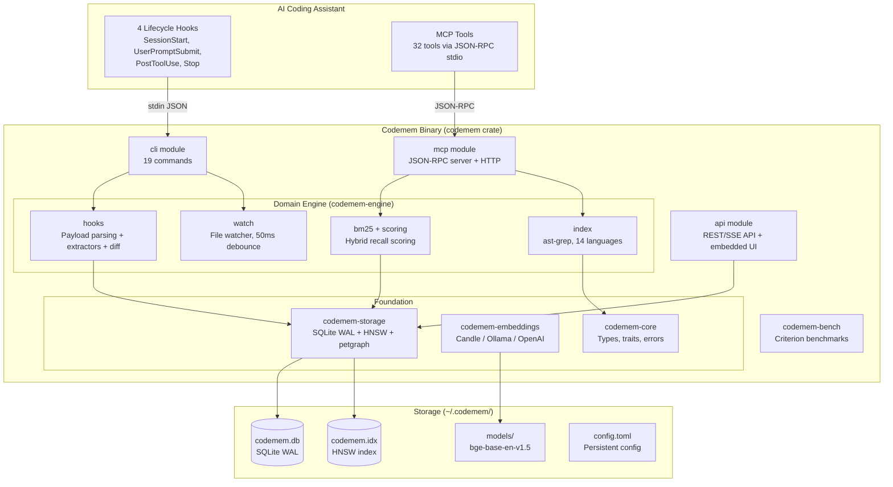
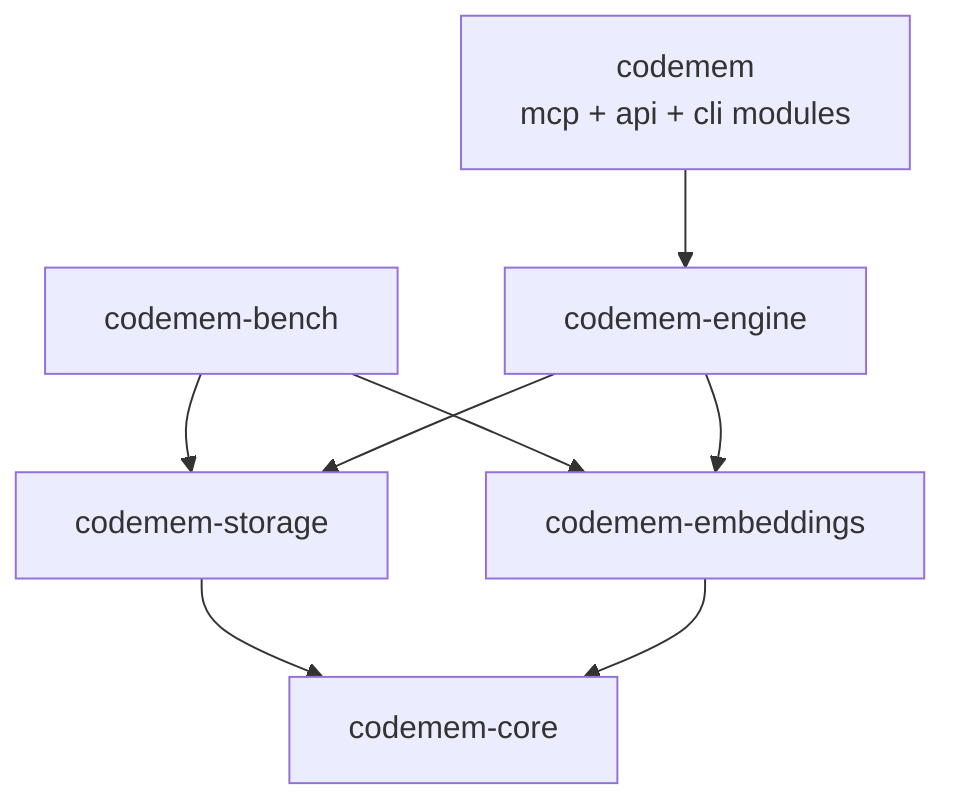
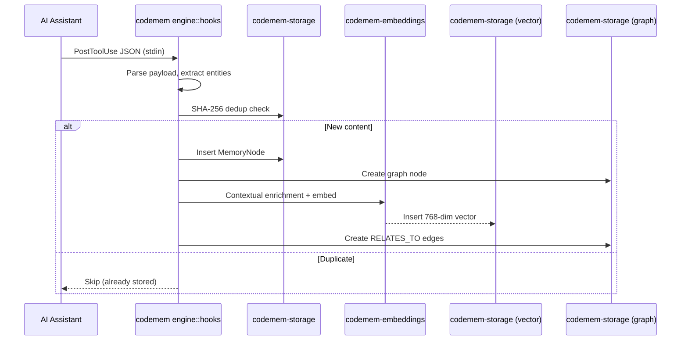
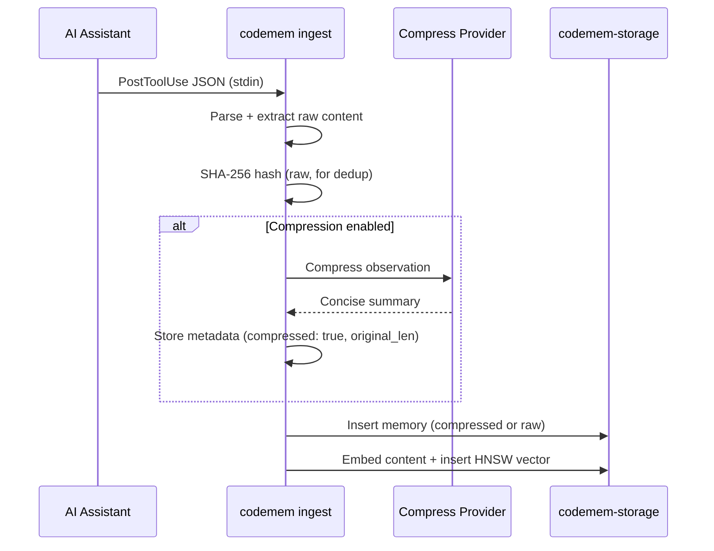
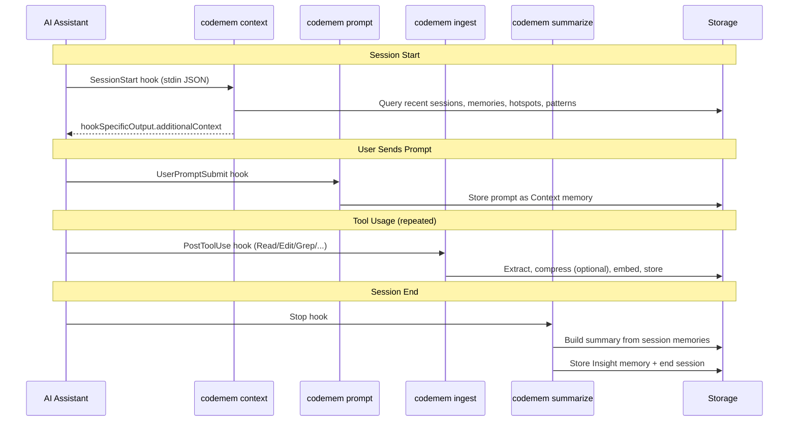
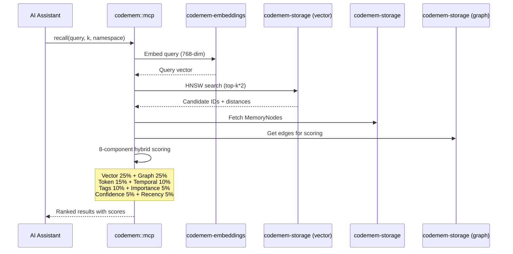
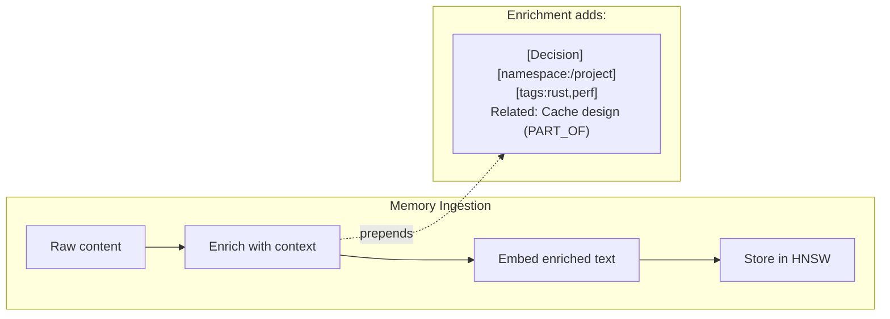
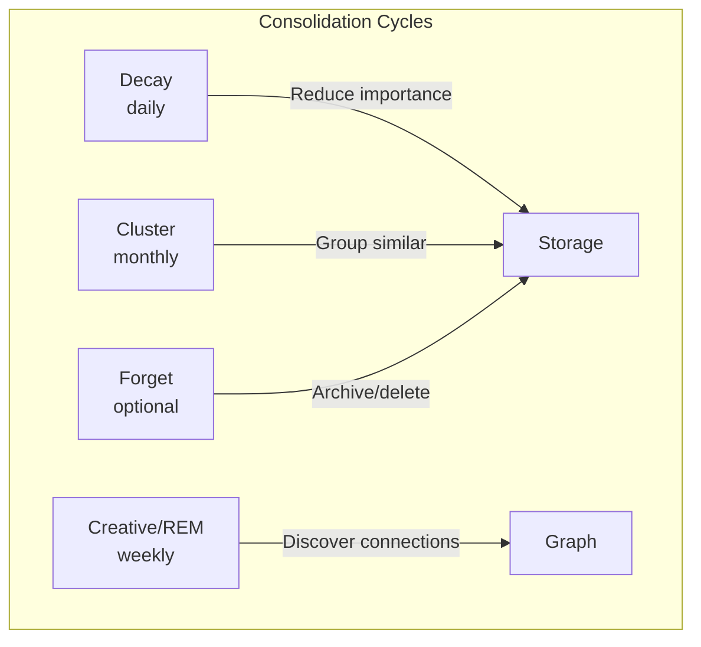
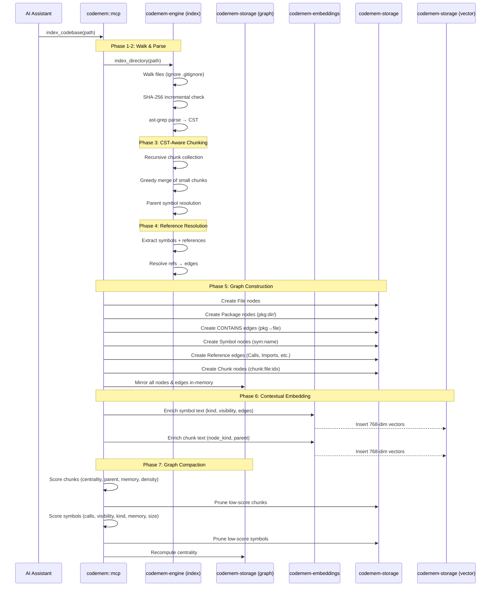
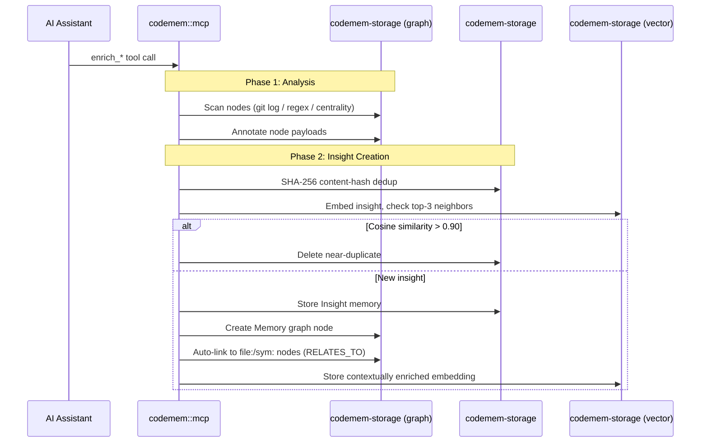

# Codemem Architecture

Codemem is a standalone Rust memory engine for AI coding assistants. A single binary (`cargo install --path crates/codemem`) stores code exploration findings so repositories do not need re-exploring across sessions, supports cross-repo structural relationships for monorepo intelligence, and wires into any MCP-compatible tool via hooks (passive capture) and MCP tools (active query).

## How Codemem Works

`codemem init` registers 4 lifecycle hooks (SessionStart, UserPromptSubmit, PostToolUse, Stop) and a stdio MCP server. The PostToolUse hook intercepts Read/Grep/Edit/Write tool calls, extracts structured observations (file paths, symbols, diff summaries), embeds them with BAAI/bge-base-en-v1.5 (768-dim, contextually enriched with metadata + graph neighbors), and stores them as typed memory nodes (Decision, Pattern, Insight, etc.) with graph edges (CALLS, IMPORTS, EVOLVED_INTO, etc.) in a single SQLite WAL database + usearch HNSW index. SessionStart injects prior context; Stop generates a structured session summary.

Recall uses 8-component hybrid scoring: vector cosine (25%), graph strength via PageRank/betweenness/degree/cluster coefficient (20%), Okapi BM25 with camelCase/snake_case tokenization (15%), temporal alignment (10%), importance (10%), confidence (10%), tag matching (5%), recency (5%). The unified `recall` tool supports optional graph expansion (`expand=true`) and impact analysis (`include_impact=true`). The graph layer (petgraph) runs 25 algorithms — PageRank, Louvain community detection, betweenness centrality, SCC, topological sort — cached per session. Recall filters expired temporal edges (valid_to < now) during graph expansion. All weights are configurable via `config.toml` and persist across restarts.

Consolidation runs 5 cycles: Decay (power-law `importance × 0.9^(days/30) × (1 + log₂(access_count) × 0.1)`), Creative (O(n log n) vector KNN + Union-Find to create SHARES_THEME edges across memory types), Cluster (cosine similarity > 0.92 deduplication), Summarize (LLM-powered connected-component summarization via Ollama/OpenAI/Anthropic), Forget (prune below threshold). Memories support self-editing: `refine_memory` creates EVOLVED_INTO provenance chains, `split_memory` decomposes via PART_OF edges, `merge_memories` combines via SUMMARIZES edges — all with temporal edge tracking (valid_from/valid_to).

---

## 1. System Overview

The following diagram shows the full Codemem system: AI assistant integration points at the top, the Codemem binary in the middle (organized as a Cargo workspace of 6 crates), and the persistent storage layer at the bottom.


```mermaid
graph TB
    subgraph "AI Coding Assistant"
        H[4 Lifecycle Hooks<br/>SessionStart, UserPromptSubmit,<br/>PostToolUse, Stop]
        M[MCP Tools<br/>32 tools via JSON-RPC stdio]
    end

    subgraph "Codemem Binary (codemem crate)"
        CLI[cli module<br/>19 commands]
        MCP_MOD[mcp module<br/>JSON-RPC server + HTTP]
        API_MOD[api module<br/>REST/SSE API + embedded UI]

        subgraph "Domain Engine (codemem-engine)"
            HOOKS[hooks<br/>Payload parsing + extractors + diff]
            WATCH[watch<br/>File watcher, 50ms debounce]
            IDX[index<br/>ast-grep, 14 languages]
            BM25[bm25 + scoring<br/>Hybrid recall scoring]
        end

        subgraph "Foundation"
            CORE[codemem-core<br/>Types, traits, errors]
            EMB[codemem-embeddings<br/>Candle / Ollama / OpenAI]
            STORE[codemem-storage<br/>SQLite WAL + HNSW + petgraph]
        end

        BENCH[codemem-bench<br/>Criterion benchmarks]
    end

    subgraph "Storage (~/.codemem/)"
        DB[(codemem.db<br/>SQLite WAL)]
        HNSW[(codemem.idx<br/>HNSW index)]
        MODEL[models/<br/>bge-base-en-v1.5]
        CONF[config.toml<br/>Persistent config]
    end

    H -->|stdin JSON| CLI
    M -->|JSON-RPC| MCP_MOD
    CLI --> HOOKS
    CLI --> WATCH
    MCP_MOD --> BM25
    MCP_MOD --> IDX
    API_MOD --> STORE
    HOOKS --> STORE
    BM25 --> STORE
    IDX --> CORE
    STORE --> DB
    STORE --> HNSW
    EMB --> MODEL
```

**Key properties:**
- Single binary, zero runtime dependencies, <100ms startup
- System-wide storage at `~/.codemem/` (no per-project directories)
- Memories and graph nodes carry an optional `namespace` column (typically the working directory at ingest time) for project-scoped queries
- All logging goes to stderr; stdout is reserved for JSON-RPC in serve mode

---

## 2. Crate Dependency Graph

Each arrow reads "depends on." The `codemem-core` crate sits at the root with no internal dependencies. Higher-level crates compose the lower-level ones. The `codemem` crate contains three transport modules (mcp, api, cli) that depend on `codemem-engine` for domain logic.


```mermaid
flowchart TD
    codemem[codemem<br/>mcp + api + cli modules]

    codemem --> engine
    bench[codemem-bench] --> storage & embeddings

    engine[codemem-engine] --> storage & embeddings
    storage[codemem-storage] --> core
    embeddings[codemem-embeddings] --> core

    core[codemem-core]
```

---

## 3. Crate Reference Table

| Crate | Description |
|-------|-------------|
| codemem-core | Shared types (`types.rs`: `MemoryNode`, `Edge`, `Session`, `DetectedPattern`), traits (`traits.rs`: `VectorBackend`/`GraphBackend`/`StorageBackend`), errors (`error.rs`), config (`config.rs`: `CodememConfig`, `ChunkingConfig`, `EnrichmentConfig` TOML persistence). 7 `MemoryType`s, 5 `PatternType`s, 24 `RelationshipType`s, 13 `NodeKind`s, `ScoringWeights` |
| codemem-storage | rusqlite (bundled) WAL mode + usearch HNSW vector index + petgraph graph engine. Split into `memory.rs` (CRUD), `graph_persistence.rs` (nodes/edges/embeddings), `queries.rs` (stats/sessions/patterns), `backend.rs` (StorageBackend trait impl), `migrations.rs` (schema versioning), `vector.rs` (HNSW 768-dim cosine, M=16, efConstruction=200), `graph/` (traversal with BFS/DFS/kind-aware filtering, algorithms: PageRank, Louvain, SCC, betweenness, topological, cached centrality, graph compaction, package nodes) |
| codemem-embeddings | Pluggable embedding providers via `EmbeddingProvider` trait + `from_env()` factory: Candle (pure Rust ML, default), Ollama (local HTTP), OpenAI-compatible (Voyage AI, Together, Azure, etc.). `CachedProvider` wrapper adds LRU cache (10K) to remote providers. BAAI/bge-base-en-v1.5 (768-dim), mean pooling, L2 normalization. Safe concurrency via `LockPoisoned` error handling |
| codemem-engine | Domain logic engine: `CodememEngine` struct holds all backends. Modules: `index/` (ast-grep code indexing, 14 languages, YAML-driven rules, manifest parsing, reference resolution), `hooks/` (PostToolUse JSON parser, per-tool extractors for 9 tool types, diff-aware memory, trigger-based auto-insights), `watch/` (real-time file watcher, <50ms debounce, .gitignore support), `enrichment/` (14 enrichment types, one file per analysis + `run_enrichments()` pipeline), `consolidation/` (5 cycles: decay, creative, cluster, forget, summarize), `persistence/` (index persistence + compaction), `analysis.rs` (decision chains, session checkpoints, impact analysis), `search.rs` (semantic/text/hybrid code search), `recall.rs` (unified recall with temporal edge filtering), `bm25.rs` (Okapi BM25 scoring with serialization), `scoring.rs` (hybrid scoring helpers), `patterns.rs` (cross-session pattern detection), `compress.rs` (LLM observation compression), `metrics.rs` (operational metrics) |
| codemem | Unified binary + library. Three transport modules: `mcp/` (JSON-RPC stdio + HTTP server, 32 MCP tools, scoring, types), `api/` (REST/SSE API with Axum, routes for memories/graph/vectors/stats/patterns/insights/agents/config/timeline/namespaces/sessions, PCA point cloud, embedded React UI), `cli/` (clap derive, 19 commands, lifecycle hooks, config management, multi-format export) |
| codemem-bench | Criterion benchmarks (vector, storage, graph), 20% CI regression threshold |

---

## 4. Data Flow -- Passive Capture (Hooks)

When an AI coding assistant uses a tool (Read, Glob, Grep, Edit, Write), the PostToolUse event is sent as JSON to stdin. Codemem's hook handler parses the payload, extracts entities, deduplicates by SHA-256 content hash, and persists the memory with its embedding and graph node.


```mermaid
sequenceDiagram
    participant AI as AI Assistant
    participant Hook as codemem engine::hooks
    participant Store as codemem-storage
    participant Emb as codemem-embeddings
    participant Vec as codemem-storage (vector)
    participant Graph as codemem-storage (graph)

    AI->>Hook: PostToolUse JSON (stdin)
    Hook->>Hook: Parse payload, extract entities
    Hook->>Store: SHA-256 dedup check
    alt New content
        Hook->>Store: Insert MemoryNode
        Hook->>Graph: Create graph node
        Hook->>Emb: Contextual enrichment + embed
        Emb-->>Vec: Insert 768-dim vector
        Hook->>Graph: Create RELATES_TO edges
    else Duplicate
        Hook-->>AI: Skip (already stored)
    end
```

**Tool-specific extraction:**

| Tool | Memory Type | Graph Node | Auto-Tags |
|------|-------------|------------|-----------|
| Read | Context | `file:<path>` (File) | `ext:rs`, `dir:src`, `file:main.rs` |
| Glob | Pattern | None | `glob:<pattern>`, `discovery` |
| Grep | Pattern | None | `pattern:<regex>`, `search` |
| Edit / MultiEdit | Decision | `file:<path>` (File) | `ext:rs`, `dir:src`, `file:lib.rs` |
| Write | Decision | `file:<path>` (File) | `ext:rs`, `dir:src`, `file:new.rs` |
| Bash | Context | `file:<path>` (if detectable) | `bash`, `command:<first_word>`, `dir:<cwd>`, `error` (if failed) |
| WebFetch / WebSearch | Context | None | `web-research`, `url:<domain>`, `query:<text>` |
| Agent / SendMessage | Context | None | `agent-communication` |
| ListFiles / ListDir | Context | None | `discovery`, `dir:<name>` |

**Edge materialization:** When a file is Edited or Written after a prior Read, an `EVOLVED_INTO` self-edge is created on the file node, capturing the explore-then-modify workflow pattern.

### Observation Compression (Optional)

When `CODEMEM_COMPRESS_PROVIDER` is set, raw observations are sent to an LLM for compression before storage. This improves both memory density and embedding quality.


```mermaid
sequenceDiagram
    participant AI as AI Assistant
    participant Hook as codemem ingest
    participant LLM as Compress Provider
    participant Store as codemem-storage

    AI->>Hook: PostToolUse JSON (stdin)
    Hook->>Hook: Parse + extract raw content
    Hook->>Hook: SHA-256 hash (raw, for dedup)
    alt Compression enabled
        Hook->>LLM: Compress observation
        LLM-->>Hook: Concise summary
        Hook->>Hook: Store metadata (compressed: true, original_len)
    end
    Hook->>Store: Insert memory (compressed or raw)
    Hook->>Store: Embed content + insert HNSW vector
```

Three providers are supported, configured via environment variables:

| Provider | Model Default | URL Default | Auth |
|----------|--------------|-------------|------|
| `ollama` | `llama3.2` | `http://localhost:11434` | None |
| `openai` | `gpt-4o-mini` | `https://api.openai.com/v1` | `OPENAI_API_KEY` |
| `anthropic` | `claude-haiku-4-5-20251001` | `https://api.anthropic.com` | `ANTHROPIC_API_KEY` |

Compression is disabled by default. On failure, falls back to raw content silently.

---

## 4.5. Data Flow -- Session Lifecycle Hooks

Codemem registers 4 lifecycle hooks during `codemem init` for full session coverage:


```mermaid
sequenceDiagram
    participant AI as AI Assistant
    participant Ctx as codemem context
    participant Prm as codemem prompt
    participant Ing as codemem ingest
    participant Sum as codemem summarize
    participant DB as Storage

    Note over AI,DB: Session Start
    AI->>Ctx: SessionStart hook (stdin JSON)
    Ctx->>DB: Query recent sessions, memories, hotspots, patterns
    Ctx-->>AI: hookSpecificOutput.additionalContext

    Note over AI,DB: User Sends Prompt
    AI->>Prm: UserPromptSubmit hook
    Prm->>DB: Store prompt as Context memory

    Note over AI,DB: Tool Usage (repeated)
    AI->>Ing: PostToolUse hook (Read/Edit/Grep/...)
    Ing->>DB: Extract, compress (optional), embed, store

    Note over AI,DB: Session End
    AI->>Sum: Stop hook
    Sum->>DB: Build summary from session memories
    Sum->>DB: Store Insight memory + end session
```

**SessionStart (`codemem context`):** Queries 5 data sources -- recent sessions with summaries, Decision/Insight/Pattern memories, file hotspots, detected patterns, and stats. Formats as compact markdown wrapped in `<codemem-context>` tags and outputs via `hookSpecificOutput.additionalContext` for silent context injection.

**UserPromptSubmit (`codemem prompt`):** Stores the user's prompt as a Context memory (importance 0.3) with `source: UserPromptSubmit` metadata. Auto-starts a session if one isn't active.

**PostToolUse (`codemem ingest`):** The existing capture pipeline. Extracts observations from Read/Glob/Grep/Edit/Write/Bash/WebFetch/WebSearch/Agent/SendMessage/ListDir, optionally compresses via LLM, embeds, and stores with graph nodes and edges. Also runs trigger-based auto-insights (directory focus, module exploration, debugging detection, repeated search patterns).

**Stop (`codemem summarize`):** Collects all memories created during the session (by timestamp), categorizes them (files read, files edited, searches, decisions, prompts), builds a structured summary, stores it as an Insight memory, and ends the session.

---

## 5. Data Flow -- Active Recall (MCP)

When an AI assistant calls `recall`, the query goes through embedding, HNSW search, metadata fetch, and 8-component hybrid scoring before results are returned. Optional graph expansion (`expand=true`) and impact analysis (`include_impact=true`) add additional passes.


```mermaid
sequenceDiagram
    participant AI as AI Assistant
    participant MCP as codemem::mcp
    participant Emb as codemem-embeddings
    participant Vec as codemem-storage (vector)
    participant Store as codemem-storage
    participant Graph as codemem-storage (graph)

    AI->>MCP: recall(query, k, namespace)
    MCP->>Emb: Embed query (768-dim)
    Emb-->>MCP: Query vector
    MCP->>Vec: HNSW search (top-k*2)
    Vec-->>MCP: Candidate IDs + distances
    MCP->>Store: Fetch MemoryNodes
    MCP->>Graph: Get edges for scoring
    MCP->>MCP: 8-component hybrid scoring
    Note over MCP: Vector 25% + Graph 25%<br/>Token 15% + Temporal 10%<br/>Tags 10% + Importance 5%<br/>Confidence 5% + Recency 5%
    MCP-->>AI: Ranked results with scores
```

**8-component hybrid scoring breakdown:**

| Component | Weight | Source |
|-----------|--------|--------|
| Vector similarity | 25% | Cosine similarity from HNSW search |
| Graph strength | 20% | Multi-factor: PageRank 40% + betweenness centrality 30% + normalized degree 20% + cluster bonus 10% |
| BM25 token overlap | 15% | Okapi BM25 scoring with code-aware tokenizer (camelCase/snake_case splitting, k1=1.2, b=0.75) |
| Temporal alignment | 10% | How closely the memory's timestamps match the query context |
| Importance | 10% | Memory importance score (0.0-1.0) |
| Confidence | 10% | Memory confidence score (0.0-1.0) |
| Tag matching | 5% | Overlap between query-derived tags and memory tags |
| Recency | 5% | Boost for recently accessed memories |

Weights are configurable via `codemem config set scoring.<key> <value>` and persist in `~/.codemem/config.toml`.

---

## 6. Data Flow -- Contextual Embeddings

Instead of embedding raw text, Codemem enriches text with metadata before embedding. This ensures that the resulting vectors capture the memory's role and relationships, not just its surface content.


```mermaid
graph LR
    subgraph "Memory Ingestion"
        A[Raw content] --> B[Enrich with context]
        B --> C[Embed enriched text]
        C --> D[Store in HNSW]
    end

    subgraph "Enrichment adds:"
        E["[Decision] [namespace:/project]<br/>[tags:rust,perf]<br/>Related: Cache design (PART_OF)"]
    end

    B -.->|prepends| E
```

**For memories**, the `enrich_memory_text` function prepends:
- Memory type (e.g., `[decision]`, `[pattern]`, `[context]`)
- Namespace (e.g., `[namespace:/Users/dev/myproject]`)
- Tags (e.g., `[tags:ext:rs,dir:src]`)
- Up to 8 graph relationships with resolved labels and direction (e.g., `-> Cache design (PART_OF); <- Config struct (RELATES_TO)`)

**For code symbols**, the `enrich_symbol_text` function prepends:
- Symbol kind and visibility (e.g., `[pub function]`, `[private method]`)
- File path (e.g., `File: src/lib.rs`)
- Parent symbol, if any (e.g., `Parent: MyStruct`)
- Up to 8 resolved edges from the code index (e.g., `-> other::func (CALLS); <- MyTrait (IMPLEMENTS)`)
- Followed by the symbol's qualified name, signature, and doc comment

This contextual enrichment means that two functions with identical names but in different files, different visibility, or different call graphs will produce distinct embeddings, dramatically improving recall precision.

---

## 7. Data Flow -- Memory Consolidation

Codemem implements neuroscience-inspired memory consolidation cycles that run on different schedules to maintain memory quality over time.


```mermaid
graph TB
    subgraph "Consolidation Cycles"
        D[Decay<br/>daily] -->|Reduce importance| S[Storage]
        C[Creative/REM<br/>weekly] -->|Discover connections| G[Graph]
        CL[Cluster<br/>monthly] -->|Group similar| S
        F[Forget<br/>optional] -->|Archive/delete| S
    end
```

**Decay (daily):** Reduces the importance score of memories that have not been accessed recently. Memories that are actively used maintain their importance; stale memories gradually fade. Configurable via `threshold_days` parameter.

**Creative/REM (weekly):** Discovers new connections between existing memories by comparing embeddings and finding high-similarity pairs across different memory types. Creates `SIMILAR_TO` and `SHARES_THEME` edges in the graph, surfacing non-obvious relationships that emerge from the accumulated knowledge.

**Cluster (monthly):** Groups similar memories together using embedding-based similarity. Identifies clusters of related memories and creates summary meta-memories (`SUMMARIZES` edges) that provide high-level overviews of common themes.

**Forget (optional):** Archives or deletes memories below an importance threshold. This is opt-in and never runs automatically. Configurable via `importance_threshold` parameter. Useful for cleaning up low-value noise after a project phase completes.

Each consolidation run is logged in the `consolidation_log` table with cycle type, timestamp, and affected count. The `consolidate` tool (with `mode=auto`) and `codemem consolidate --status` CLI command report the last run for each cycle type.

---

## 7.5. Data Flow -- Code Indexing & Graph Compaction

When `index_codebase` is called (via MCP tool or CLI), the codebase goes through an 8-phase pipeline: directory walking, ast-grep parsing, CST-aware chunking, reference resolution, graph construction (files, packages, symbols, chunks), contextual embedding, graph compaction, and centrality recomputation.


```mermaid
sequenceDiagram
    participant AI as AI Assistant
    participant MCP as codemem::mcp
    participant IDX as codemem-engine (index)
    participant Graph as codemem-storage (graph)
    participant Emb as codemem-embeddings
    participant Store as codemem-storage
    participant Vec as codemem-storage (vector)

    AI->>MCP: index_codebase(path)

    Note over MCP,IDX: Phase 1-2: Walk & Parse
    MCP->>IDX: index_directory(path)
    IDX->>IDX: Walk files (ignore .gitignore)
    IDX->>IDX: SHA-256 incremental check
    IDX->>IDX: ast-grep parse → CST

    Note over IDX: Phase 3: CST-Aware Chunking
    IDX->>IDX: Recursive chunk collection
    IDX->>IDX: Greedy merge of small chunks
    IDX->>IDX: Parent symbol resolution

    Note over IDX: Phase 4: Reference Resolution
    IDX->>IDX: Extract symbols + references
    IDX->>IDX: Resolve refs → edges

    Note over MCP,Store: Phase 5: Graph Construction
    MCP->>Store: Create File nodes
    MCP->>Store: Create Package nodes (pkg:dir/)
    MCP->>Store: Create CONTAINS edges (pkg→file)
    MCP->>Store: Create Symbol nodes (sym:name)
    MCP->>Store: Create Reference edges (Calls, Imports, etc.)
    MCP->>Store: Create Chunk nodes (chunk:file:idx)
    MCP->>Graph: Mirror all nodes & edges in-memory

    Note over MCP,Vec: Phase 6: Contextual Embedding
    MCP->>Emb: Enrich symbol text (kind, visibility, edges)
    Emb-->>Vec: Insert 768-dim vectors
    MCP->>Emb: Enrich chunk text (node_kind, parent)
    Emb-->>Vec: Insert 768-dim vectors

    Note over MCP,Graph: Phase 7: Graph Compaction
    MCP->>MCP: Score chunks (centrality, parent, memory, density)
    MCP->>Store: Prune low-score chunks
    MCP->>MCP: Score symbols (calls, visibility, kind, memory, size)
    MCP->>Store: Prune low-score symbols
    MCP->>Graph: Recompute centrality
```

### CST-Aware Chunking (Phase 3)

Tree-sitter produces a Concrete Syntax Tree preserving the full source structure. The chunker operates in four steps:

1. **Recursive collection**: Starting at the CST root, each node is measured by non-whitespace character count. If a node fits within `max_chunk_size` (default 1500 chars), it becomes a chunk. Otherwise, its named children are recursed into. This ensures chunks align to syntactic boundaries (function bodies, struct definitions, impl blocks) rather than arbitrary line counts.

2. **Greedy merge**: Adjacent small chunks below `min_chunk_size` (default 50 chars) are merged with their neighbor if the combined size stays within `max_chunk_size`. This prevents proliferation of tiny fragments (e.g., a single `use` statement). Merged chunks preserve comma-separated `node_kind` labels from their constituents.

3. **Overlap (optional)**: When `overlap_lines > 0`, trailing lines from the previous chunk are prepended to the current chunk, providing context continuity at chunk boundaries.

4. **Parent resolution**: Each chunk is matched to its innermost containing symbol using a pre-sorted `SymbolIntervalIndex` with O(log n) binary search (replacing the previous O(n) linear scan). This creates the structural link between chunks and their parent function/method/class.

### Package Node Hierarchy (Phase 5)

During graph construction, each file's parent directories are walked upward to create a tree of `Package` nodes:

```
pkg:/project/         ──CONTAINS──▶  pkg:/project/src/
pkg:/project/src/     ──CONTAINS──▶  pkg:/project/src/lib/
pkg:/project/src/lib/ ──CONTAINS──▶  file:/project/src/lib/main.rs
```

This enables the `summary_tree` tool to browse the codebase hierarchically (packages → files → symbols → chunks) following `CONTAINS` edges.

### Graph Compaction (Phase 7)

Compaction reduces graph traversal complexity while preserving all embeddings in the vector index. Pruned nodes remain semantically searchable but are no longer graph-traversal-reachable. Controlled by `ChunkingConfig`.

**Pass 1 — Chunk scoring and pruning:**

Each chunk is scored on four factors (weights adjust on cold start — when no memories exist, memory link weight is redistributed to centrality and content density):

| Factor | Weight | Cold-Start Weight | Source |
|--------|--------|-------------------|--------|
| Centrality rank | 30% | 40% | Normalized edge degree (how connected) |
| Has symbol parent | 20% | 30% | 1.0 if chunk belongs to a named symbol |
| Memory link | 30% | 0% | 1.0 if any edge connects to a memory node |
| Content density | 20% | 30% | Normalized non-whitespace character count |

Per file, retain at least `max(3, symbol_count)` chunks and at most `max_retained_chunks_per_file` (default 10). Chunks below `min_chunk_score_threshold` (default 0.2) are always pruned. When a chunk is pruned, its line range is annotated on the parent symbol's `covered_ranges` payload.

**Pass 2 — Symbol scoring and pruning:**

Each symbol is scored on five factors (weights adjust on cold start — when no memories exist, memory link weight is redistributed to call connectivity and code size):

| Factor | Weight | Cold-Start Weight | Source |
|--------|--------|-------------------|--------|
| Call connectivity | 30% | 40% | Normalized count of CALLS edges |
| Visibility | 20% | 20% | public=1.0, crate=0.5, private=0.0 |
| Kind | 15% | 15% | Class/Interface/Module=1.0, Function/Method=0.6, Test=0.3, Constant=0.1 |
| Memory link | 20% | 0% | 1.0 if connected to a memory node |
| Code size | 15% | 25% | Normalized line span |

**Always retained (never pruned):** Class, Interface, and Module nodes (structural anchors) and any symbol linked to a memory node. Per file, retain at least `max(max_retained_symbols_per_file, public_symbol_count)` (default 15). Symbols below `min_symbol_score_threshold` (default 0.15) are pruned.

After compaction, `compute_centrality()` and `recompute_centrality()` (PageRank + betweenness) are re-run on the pruned graph.

---

## 7.6. Data Flow -- Enrichment Pipeline

14 enrichment types analyze the code graph and produce `Insight` memories tagged `static-analysis`. The three primary types (`enrich_git_history`, `enrich_security`, `enrich_performance`) are exposed as MCP tools via `enrich_codebase`. 11 additional types run as part of the `analyze_codebase` pipeline or can be called programmatically: complexity (cyclomatic/cognitive), architecture inference, test mapping, API surface analysis, doc coverage, change impact, code smells, hot+complex correlation, blame/ownership, advanced security scanning, and quality stratification.

All insights go through a shared `store_insight()` pipeline with content-hash dedup, semantic near-duplicate rejection (cosine > `dedup_similarity_threshold`, default 0.90), and auto-linking to code nodes.


```mermaid
sequenceDiagram
    participant AI as AI Assistant
    participant MCP as codemem::mcp
    participant Graph as codemem-storage (graph)
    participant Store as codemem-storage
    participant Vec as codemem-storage (vector)

    AI->>MCP: enrich_* tool call

    Note over MCP,Graph: Phase 1: Analysis
    MCP->>Graph: Scan nodes (git log / regex / centrality)
    MCP->>Graph: Annotate node payloads

    Note over MCP,Store: Phase 2: Insight Creation
    MCP->>Store: SHA-256 content-hash dedup
    MCP->>Vec: Embed insight, check top-3 neighbors
    alt Cosine similarity > 0.90
        MCP->>Store: Delete near-duplicate
    else New insight
        MCP->>Store: Store Insight memory
        MCP->>Graph: Create Memory graph node
        MCP->>Graph: Auto-link to file:/sym: nodes (RELATES_TO)
        MCP->>Vec: Store contextually enriched embedding
    end
```

### enrich_git_history

Runs `git log` for the specified time window and produces three types of data:

1. **Node annotations**: File nodes get `git_commit_count`, `git_authors`, `git_churn_rate` (commits/month) in their payload.
2. **CO_CHANGED edges**: File pairs that appear in the same commit ≥2 times get temporal edges with `valid_from`/`valid_to` timestamps and weight = `co_occurrence_count / total_commits`.
3. **Insights**: "High activity" files (commits > `git_min_commit_count`, default 25), "Co-change patterns" (co-occurrences ≥ `git_min_co_change_count`, default 5), and "Top contributors" (top 3 authors).

### enrich_security

Scans all graph nodes with regex patterns for security-sensitive code:

1. **File scan**: Matches paths containing `auth`, `secret`, `key`, `password`, `token`, `credential`, `.env`, `encrypt`, etc. → `security_flags: ["sensitive"]`.
2. **Endpoint scan**: All `Endpoint` nodes flagged → `security_flags: ["exposed_endpoint"]`.
3. **Function scan**: Matches function names like `hash`, `verify`, `sign`, `encrypt`, `authenticate`, `authorize`, `validate_token` → `security_flags: ["security_function"]`.
4. **Insights**: Per sensitive file (importance 0.8, severity:high), endpoint aggregate (importance 0.7, severity:medium), per security function (importance 0.6, severity:medium).

### enrich_performance

Analyzes structural complexity and dependency depth:

1. **Coupling scores**: Edge degree per node, annotated as `coupling_score` in payload. Insights for nodes exceeding `perf_min_coupling_degree` (default 25).
2. **Dependency layers**: Topological sort assigns `dependency_layer` to each node. Insight fires when chain depth > 5.
3. **Critical path**: File nodes ranked by PageRank; top file annotated as `critical_path_rank`. Insight for the highest-centrality file (importance 0.8).
4. **Complexity**: Files with symbol count > `perf_min_symbol_count` (default 30) get `symbol_count` annotation and a "Complex file" insight.

### Graph Strength Bridge

The enrichment pipeline feeds directly into recall scoring. When `store_insight()` creates `RELATES_TO` edges from insight memories to `file:` and `sym:` code nodes, the `graph_strength_for_memory()` function bridges these connections:

```
graph_strength = 0.4 × max_pagerank(connected_code_nodes)
               + 0.3 × max_betweenness(connected_code_nodes)
               + 0.2 × connectivity_bonus(code_neighbor_count / 5)
               + 0.1 × edge_weight_bonus(avg_edge_weight)
```

This means enrichment insights connected to high-PageRank files automatically score higher in recall, creating a self-reinforcing loop: structurally important code produces higher-scoring insights.

---

## 8. Storage Schema

All persistent state lives in a single SQLite database at `~/.codemem/codemem.db`, configured with WAL mode, 64MB cache, 256MB memory-mapped I/O, and foreign key enforcement. Configuration is stored in `~/.codemem/config.toml` (TOML format, loaded at startup, partial configs merge with defaults).

The schema is managed by versioned, idempotent migrations tracked in a `schema_version` table. Migrations are applied automatically on startup.

### `memories` table

| Column | Type | Description |
|--------|------|-------------|
| `id` | TEXT PK | UUID v4 |
| `content` | TEXT NOT NULL | Memory content |
| `memory_type` | TEXT NOT NULL | One of: decision, pattern, preference, style, habit, insight, context |
| `importance` | REAL | 0.0-1.0, default 0.5 |
| `confidence` | REAL | 0.0-1.0, default 1.0 |
| `access_count` | INTEGER | Bumped on every get |
| `content_hash` | TEXT | SHA-256 for deduplication |
| `tags` | TEXT | JSON array of tag strings |
| `metadata` | TEXT | JSON object of arbitrary key-value pairs |
| `namespace` | TEXT | Project path for scoped queries (nullable) |
| `created_at` | INTEGER | Unix timestamp |
| `updated_at` | INTEGER | Unix timestamp |
| `last_accessed_at` | INTEGER | Unix timestamp |

Indexes: `memory_type`, `content_hash`, `importance`, `created_at`, `namespace`.

### `memory_embeddings` table

| Column | Type | Description |
|--------|------|-------------|
| `memory_id` | TEXT PK | FK to `memories.id` (CASCADE delete) |
| `embedding` | BLOB NOT NULL | 768-dim float32 vector (3,072 bytes) |
| `model` | TEXT | Default: `'all-MiniLM-L6-v2'` (schema default; actual model is `bge-base-en-v1.5`) |

### `graph_nodes` table

| Column | Type | Description |
|--------|------|-------------|
| `id` | TEXT PK | Node identifier (e.g., `file:src/main.rs`, `sym:crate::func`) |
| `kind` | TEXT NOT NULL | One of the 13 `NodeKind` values |
| `label` | TEXT | Human-readable label |
| `payload` | TEXT | JSON object for arbitrary properties |
| `centrality` | REAL | Degree centrality score, default 0.0 |
| `memory_id` | TEXT | FK to `memories.id` (SET NULL on delete), nullable |
| `namespace` | TEXT | Project path for scoped queries (nullable) |

Indexes: `kind`, `memory_id`.

### `graph_edges` table

| Column | Type | Description |
|--------|------|-------------|
| `id` | TEXT PK | Edge identifier |
| `src` | TEXT NOT NULL | FK to `graph_nodes.id` (CASCADE delete) |
| `dst` | TEXT NOT NULL | FK to `graph_nodes.id` (CASCADE delete) |
| `relationship` | TEXT NOT NULL | One of the 24 `RelationshipType` values |
| `weight` | REAL | Edge weight, default 1.0 |
| `properties` | TEXT | JSON object for arbitrary properties |
| `created_at` | INTEGER | Unix timestamp |

Indexes: `src`, `dst`, `relationship`.

### `consolidation_log` table

| Column | Type | Description |
|--------|------|-------------|
| `id` | INTEGER PK AUTOINCREMENT | Auto-increment ID |
| `cycle_type` | TEXT NOT NULL | One of: decay, creative, cluster, forget |
| `run_at` | INTEGER NOT NULL | Unix timestamp |
| `affected_count` | INTEGER NOT NULL | Number of memories affected |

Index: `(cycle_type, run_at)`.

### `sessions` table

| Column | Type | Description |
|--------|------|-------------|
| `id` | TEXT PK | Session UUID |
| `namespace` | TEXT | Project scope (nullable) |
| `started_at` | INTEGER NOT NULL | Unix timestamp |
| `ended_at` | INTEGER | Unix timestamp (NULL while active) |
| `memory_count` | INTEGER | Number of memories in session, default 0 |
| `summary` | TEXT | Optional session summary |

Indexes: `namespace`, `started_at`.

### `schema_version` table

| Column | Type | Description |
|--------|------|-------------|
| `version` | INTEGER PK | Migration version number |
| `description` | TEXT NOT NULL | Human-readable migration description |
| `applied_at` | INTEGER NOT NULL | Unix timestamp when migration was applied |

### `file_hashes` table

| Column | Type | Description |
|--------|------|-------------|
| `file_path` | TEXT PK | Absolute file path |
| `content_hash` | TEXT NOT NULL | SHA-256 hash of file contents |
| `indexed_at` | INTEGER NOT NULL | Unix timestamp of last indexing |

Used by incremental indexing to skip unchanged files on re-index.

---

## 9. Graph Model

### Node Types (13 `NodeKind` variants)

| Kind | Description |
|------|-------------|
| File | Source file node |
| Package | Package/crate node |
| Function | Standalone function |
| Method | Class/struct method |
| Class | Class/struct definition |
| Interface | Trait (Rust), interface (TypeScript/Go/Java) |
| Type | Type alias, typedef |
| Constant | Const, static, enum variant |
| Module | Module/namespace |
| Memory | Codemem memory node |
| Endpoint | REST/gRPC endpoint definition |
| Test | Test function |
| Chunk | CST-aware code chunk (sub-file fragment) |

### Relationship Types (24 `RelationshipType` variants)

| Category | Relationship | Description |
|----------|-------------|-------------|
| General | `RELATES_TO` | Generic association |
| General | `LEADS_TO` | Causal or sequential link |
| General | `PART_OF` | Containment / composition |
| Knowledge | `REINFORCES` | Strengthens another memory |
| Knowledge | `CONTRADICTS` | Conflicts with another memory |
| Knowledge | `EVOLVED_INTO` | A memory that replaced or refined another |
| Knowledge | `DERIVED_FROM` | Created based on another memory |
| Knowledge | `INVALIDATED_BY` | Superseded or made obsolete |
| Code | `DEPENDS_ON` | Package/module dependency |
| Code | `IMPORTS` | Import statement |
| Code | `EXTENDS` | Extension or mixin |
| Code | `CALLS` | Function/method call |
| Code | `CONTAINS` | Parent contains child |
| Code | `SUPERSEDES` | Replaced by a newer version |
| Code | `BLOCKS` | Blocking dependency |
| Structural | `IMPLEMENTS` | Implements interface/trait |
| Structural | `INHERITS` | Class inheritance |
| Semantic | `SIMILAR_TO` | Semantic similarity above threshold |
| Semantic | `PRECEDED_BY` | Temporal adjacency |
| Semantic | `EXEMPLIFIES` | Memory exemplifies a pattern |
| Semantic | `EXPLAINS` | Insight explains a pattern |
| Semantic | `SHARES_THEME` | High similarity across types (consolidation) |
| Semantic | `SUMMARIZES` | Meta-memory summarizes a cluster |
| Temporal | `CO_CHANGED` | Files that frequently change together in git commits |

### Graph Algorithms (implemented in `codemem-storage::graph`)

| Algorithm | Function | Description |
|-----------|----------|-------------|
| BFS | `bfs()` | Breadth-first traversal up to max depth |
| DFS | `dfs()` | Depth-first traversal up to max depth |
| Shortest Path | `shortest_path()` | Shortest path between two nodes |
| Connected Components | `connected_components()` | Undirected connected components |
| Strongly Connected Components | `strongly_connected_components()` | Tarjan's SCC algorithm |
| Degree Centrality | `compute_centrality()` | `(in_degree + out_degree) / (N - 1)` |
| PageRank | `pagerank()` | Iterative PageRank with configurable damping and tolerance |
| Personalized PageRank | `personalized_pagerank()` | PageRank biased toward seed nodes |
| Louvain Communities | `louvain_communities()` | Community detection with configurable resolution |
| Betweenness Centrality | `betweenness_centrality()` | Brandes' algorithm for node importance |
| Topological Layers | `topological_layers()` | Layer-by-layer topological ordering (DAG) |
| Filtered BFS | `bfs_filtered()` | BFS that skips specified node kinds and restricts to specified relationship types |
| Filtered DFS | `dfs_filtered()` | DFS that skips specified node kinds and restricts to specified relationship types |
| Multi-hop Expansion | `expand()` | Expand N hops from a set of seed nodes |
| Neighbor Lookup | `neighbors()` | Direct neighbors of a node |

---

## 10. Embedding Pipeline

| Property | Value |
|----------|-------|
| **Architecture** | Pluggable via `EmbeddingProvider` trait, selected at runtime by `from_env()` factory |
| **Default provider** | Candle (pure Rust ML, no C++ dependencies) |
| **Default model** | BAAI/bge-base-en-v1.5 (768-dim, ~440MB) |
| **Alternative providers** | Ollama (local HTTP, default: nomic-embed-text), OpenAI-compatible (any API, default: text-embedding-3-small) |
| **Weights format** | safetensors (memory-mapped via `VarBuilder::from_mmaped_safetensors`) |
| **Tokenizer** | HuggingFace `tokenizers` crate (Candle provider only) |
| **Max sequence length** | 512 tokens (Candle), provider-dependent for others |
| **Pooling** | Mean pooling weighted by attention mask (Candle) |
| **Normalization** | L2 (Candle) |
| **Cache** | LRU, 10,000 entries (all providers) |
| **Context enrichment** | Metadata + graph relationships prepended before embedding |
| **Model download** | Automatic via `hf-hub` on `codemem init` (Candle only) |
| **Storage location** | `~/.codemem/models/bge-base-en-v1.5/` (Candle only) |

### Provider Selection

The `from_env()` factory reads environment variables and returns a `Box<dyn EmbeddingProvider>`:

| Variable | Values | Default |
|----------|--------|---------|
| `CODEMEM_EMBED_PROVIDER` | `candle`, `ollama`, `openai` | `candle` |
| `CODEMEM_EMBED_MODEL` | model name | provider default |
| `CODEMEM_EMBED_URL` | base URL | provider default |
| `CODEMEM_EMBED_API_KEY` | API key | also reads `OPENAI_API_KEY` |
| `CODEMEM_EMBED_DIMENSIONS` | integer | `768` |

The `openai` provider works with any OpenAI-compatible embedding API (Voyage AI, Together, Azure OpenAI, etc.) by setting `CODEMEM_EMBED_URL`.

Ollama and OpenAI providers are wrapped in `CachedProvider` which adds an LRU cache (10K entries). Candle's `EmbeddingService` has its own built-in cache.

### Candle Pipeline (Default)

1. **Tokenize**: Input text is tokenized with the HuggingFace tokenizer, truncated to 512 tokens
2. **Forward pass**: Token IDs and attention mask are fed through the BERT model (`BertModel::forward`)
3. **Mean pooling**: The last hidden states are averaged, weighted by the attention mask, producing a single 768-dim vector
4. **L2 normalize**: The vector is L2-normalized so cosine similarity can be computed efficiently
5. **Cache**: The result is stored in an LRU cache keyed by the input text string

For production use, the contextual enrichment step (Section 6) runs before step 1, prepending metadata that encodes the memory's type, namespace, tags, and graph relationships into the text.

---

## 11. Key Dependencies

| Crate | Purpose |
|-------|---------|
| `candle-core` / `candle-nn` / `candle-transformers` | Pure Rust ML inference (BERT model loading and forward pass) |
| `usearch` | HNSW vector index with SIMD acceleration |
| `rusqlite` (bundled) | SQLite storage with WAL mode |
| `petgraph` | Directed graph data structure and algorithms |
| `tokenizers` | HuggingFace tokenizer for bge-base-en-v1.5 |
| `hf-hub` | Model download from HuggingFace Hub |
| `ast-grep-core` + `ast-grep-language` | Code parsing for 14 languages (Rust, TypeScript/JS/JSX, Python, Go, C/C++, Java, Ruby, C#, Kotlin, Swift, PHP, Scala, HCL) |
| `clap` | CLI framework with derive macros |
| `serde` / `serde_json` | Serialization for JSON-RPC, storage, and configuration |
| `tokio` | Async runtime for MCP server and viz dashboard |
| `axum` + `tower-http` | HTTP framework for the visualization dashboard |
| `ndarray` | Numerical arrays for PCA dimensionality reduction in viz |
| `lru` | LRU cache for embedding deduplication |
| `sha2` | SHA-256 content hashing for memory deduplication |
| `chrono` | Timestamp handling with serde support |
| `uuid` | UUID v4 generation for memory and edge IDs |
| `tracing` / `tracing-subscriber` | Structured logging |
| `thiserror` / `anyhow` | Error handling |
| `walkdir` / `ignore` | Filesystem traversal for code indexing (respects `.gitignore`) |
| `toml` | Cargo.toml manifest parsing and persistent configuration |
| `ignore` | Gitignore-aware file filtering for watcher |
| `similar` | Line-level text diffing for semantic diff summaries |
| `notify` / `notify-debouncer-mini` | Filesystem event watcher with 50ms debouncing |
| `crossbeam-channel` | Multi-producer, multi-consumer channels for file watch events |
| `reqwest` | HTTP client for Ollama/OpenAI embedding providers |
| `criterion` | Benchmarking framework with regression detection |

---

## 12. MCP Tools (28 primary + legacy aliases)

### Memory CRUD (7)
| Tool | Description |
|------|-------------|
| `store_memory` | Store a new memory with auto-embedding, type classification, graph linking, and auto-linking to code nodes |
| `recall` | Unified search: 8-component hybrid scoring with optional graph expansion (`expand=true`) and impact analysis (`include_impact=true`) |
| `delete_memory` | Delete a memory and its embedding |
| `associate_memories` | Create a typed relationship between two nodes in the knowledge graph |
| `refine_memory` | Refine a memory (default: new version via EVOLVED_INTO; `destructive=true`: update in-place) |
| `split_memory` | Split a memory into parts with PART_OF edges |
| `merge_memories` | Merge multiple memories into one with SUMMARIZES edges |

### Graph & Structure (7)
| Tool | Description |
|------|-------------|
| `graph_traverse` | Multi-hop BFS/DFS traversal with kind and relationship filtering |
| `summary_tree` | Hierarchical package/file/symbol tree browser |
| `codemem_status` | Unified status: stats, health, and metrics (replaces `codemem_stats`/`codemem_health`/`codemem_metrics`) |
| `index_codebase` | Index a directory with ast-grep (14 languages) |
| `search_code` | Search code by meaning (`semantic`), name (`text`), or both (`hybrid`) |
| `get_symbol_info` | Get symbol details, optionally with graph dependencies |
| `get_symbol_graph` | Symbol dependency graph and impact analysis (replaces `get_dependencies`/`get_impact`) |

### Graph Analysis (3)
| Tool | Description |
|------|-------------|
| `find_important_nodes` | PageRank to find most central nodes (replaces `get_pagerank`) |
| `find_related_groups` | Louvain community detection (replaces `get_clusters`) |
| `get_cross_repo` | Cross-package dependency analysis (Cargo.toml, package.json, go.mod, pyproject.toml) |

### Consolidation & Patterns (3)
| Tool | Description |
|------|-------------|
| `consolidate` | Unified consolidation: `auto`, `decay`, `creative`, `cluster`, `forget`, `summarize` modes |
| `detect_patterns` | Cross-session patterns with `json`, `markdown`, or `both` output formats |
| `get_decision_chain` | Decision evolution via EVOLVED_INTO/LEADS_TO/DERIVED_FROM edges |

### Namespace Management (3)
| Tool | Description |
|------|-------------|
| `list_namespaces` | List all namespaces with inline stats |
| `namespace_stats` | Detailed stats for a namespace |
| `delete_namespace` | Delete all memories in a namespace |

### Session & Context (2)
| Tool | Description |
|------|-------------|
| `session_checkpoint` | Mid-session progress report with activity summary and pattern detection |
| `session_context` | Recent memories, pending analyses, active patterns, and focus areas |

### Enrichment (5)
| Tool | Description |
|------|-------------|
| `enrich_codebase` | Composite enrichment: runs all 14 analyses (or a selected subset) in one call |
| `analyze_codebase` | Full pipeline: index -> enrich (all 14) -> PageRank -> clusters -> summary |
| `enrich_git_history` | Git commit history analysis with CO_CHANGED edges and activity insights |
| `enrich_security` | Security pattern analysis: auth checks, validation, trust boundaries |
| `enrich_performance` | Performance hotspot analysis using centrality and connectivity metrics |
